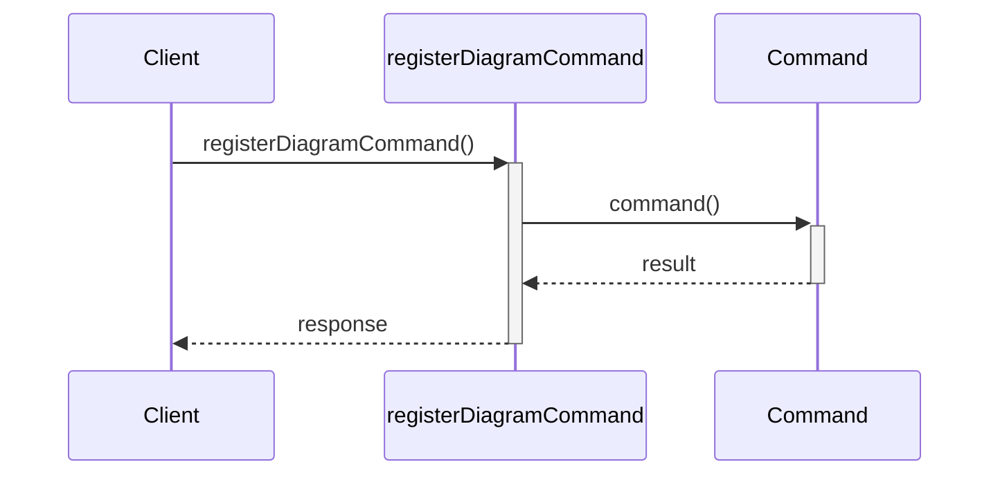
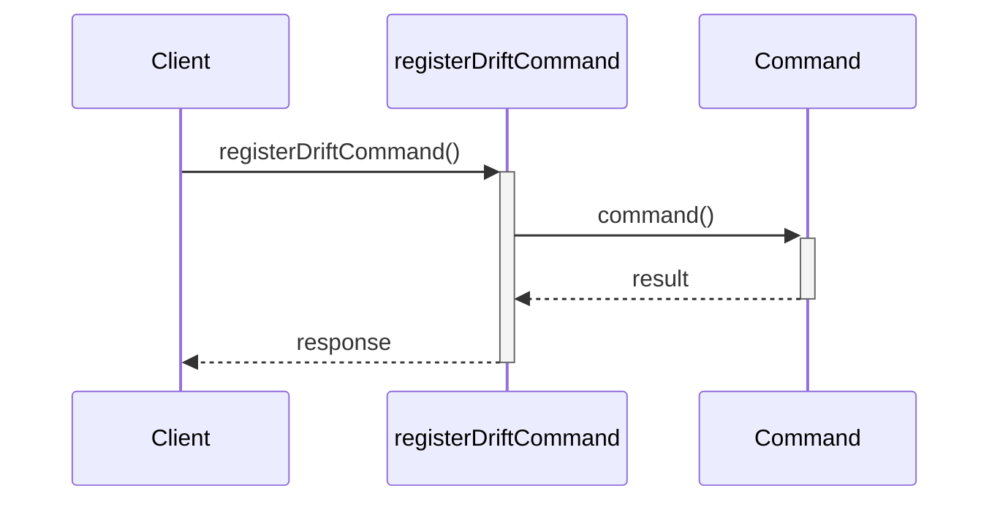
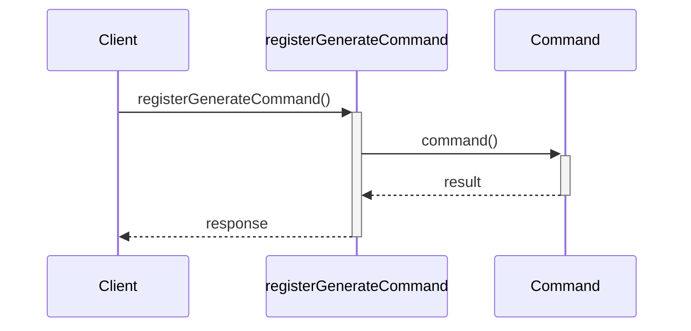
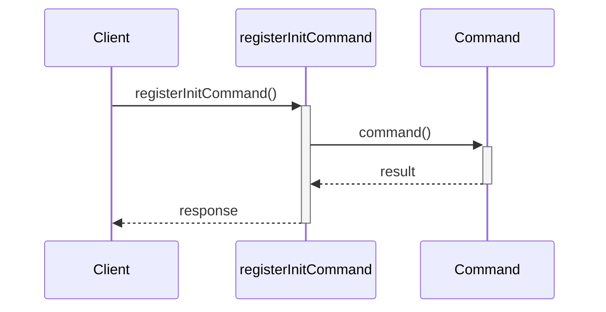

# Cli — CLI層 API Spec

## Responsibilities & Constraints

| Item | Detail |
| --- | --- |
| **Path** | `src/cli/` |
| **Responsibility** | CLIインターフェースの提供 |
| **Forbidden Imports** | — |

CLIコマンドの定義とエントリポイント。
init / generate / drift サブコマンドの実装。

## Other

### 🔧 `createProgram`

> **File**: `index.ts`

全CLIサブコマンドを登録したCommander.jsプログラムを作成する。

```ts
createProgram(): Command
```

**Returns**: `Command` 設定済みのCommanderプログラム

## Command

### 🔧 `registerDiagramCommand`

> **File**: `diagram.ts`

単体ダイアグラム生成用の'diagram'サブコマンドを登録する。

```ts
registerDiagramCommand(program: Command): void
```

| Parameter | Type | Description |
| --- | --- | --- |
| `program` | `Command` | Commanderプログラム |

**Called By**

- `createProgram()` — Cli (`index.ts`)



### 🔧 `registerDriftCommand`

> **File**: `drift.ts`

仕様ドリフト検出用の'drift'サブコマンドを登録する。

```ts
registerDriftCommand(program: Command): void
```

| Parameter | Type | Description |
| --- | --- | --- |
| `program` | `Command` | Commanderプログラム |

**Called By**

- `createProgram()` — Cli (`index.ts`)



### 🔧 `registerGenerateCommand`

> **File**: `generate.ts`

ドキュメント生成用の'generate'サブコマンドを登録する。

```ts
registerGenerateCommand(program: Command): void
```

| Parameter | Type | Description |
| --- | --- | --- |
| `program` | `Command` | Commanderプログラム |

**Called By**

- `createProgram()` — Cli (`index.ts`)



### 🔧 `registerInitCommand`

> **File**: `init.ts`

layers.yaml初期化用の'init'サブコマンドを登録する。

```ts
registerInitCommand(program: Command): void
```

| Parameter | Type | Description |
| --- | --- | --- |
| `program` | `Command` | Commanderプログラム |

**Called By**

- `createProgram()` — Cli (`index.ts`)


