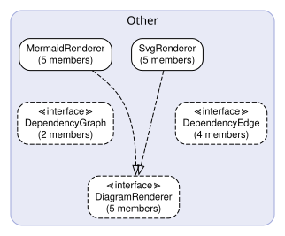
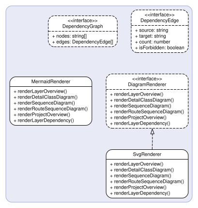

# Diagram — ダイアグラム層 API Spec

## Responsibilities & Constraints

| Item | Detail |
| --- | --- |
| **Path** | `src/diagram/` |
| **Responsibility** | ダイアグラム生成 |
| **Forbidden Imports** | `src/cli`, `src/config`, `src/extractor` |

Mermaid/DOT形式のアーキテクチャ図を生成。
レイヤー間依存関係・オブジェクト関連図のレンダリング。



## Other



### 🏗️ `MermaidRenderer`

> **File**: `mermaid-renderer.ts`
> **Type**: Other

DiagramRendererのMermaid実装。
Markdownに埋め込み可能なMermaidコードブロックを返す。

**Methods**

#### `renderLayerOverview(extraction: LayerExtraction): Promise<string | null>`

| Parameter | Type | Description |
| --- | --- | --- |
| `extraction` | `LayerExtraction` | — |

**Returns**: `Promise<string or null>` 

**Called By**

- `generateLayerMd()` — Generator (`layer-generator.ts`) via `DiagramRenderer`

#### `renderDetailClassDiagram(classes: ClassInfo[], interfaces: InterfaceInfo[]): Promise<string | null>`

| Parameter | Type | Description |
| --- | --- | --- |
| `classes` | `ClassInfo[]` | — |
| `interfaces` | `InterfaceInfo[]` | — |

**Returns**: `Promise<string or null>` 

**Called By**

- `renderGroupDiagramAndItems()` — Generator (`layer-generator.ts`) via `DiagramRenderer`

#### `renderSequenceDiagram(chain: ClassCallChain): Promise<string | null>`

| Parameter | Type | Description |
| --- | --- | --- |
| `chain` | `ClassCallChain` | — |

**Returns**: `Promise<string or null>` 

**Called By**

- `renderMethodSequenceDiagram()` — Generator (`layer-generator.ts`) via `DiagramRenderer`
- `renderFunctionSequenceDiagram()` — Generator (`layer-generator.ts`) via `DiagramRenderer`

#### `renderRouteSequenceDiagram(funcName: string, route: RouteInfo): Promise<string | null>`

| Parameter | Type | Description |
| --- | --- | --- |
| `funcName` | `string` | — |
| `route` | `RouteInfo` | — |

**Returns**: `Promise<string or null>` 

**Called By**

- `renderFunction()` — Generator (`layer-generator.ts`) via `DiagramRenderer`

#### `renderProjectOverview(extractions: LayerExtraction[], layers?: LayerConfig[] | undefined): Promise<string | null>`

| Parameter | Type | Description |
| --- | --- | --- |
| `extractions` | `LayerExtraction[]` | — |
| `layers` | `LayerConfig[] or undefined` | — |

**Returns**: `Promise<string or null>` 

**Called By**

- `generateIndexMd()` — Generator (`index-generator.ts`) via `DiagramRenderer`

### 🏗️ `SvgRenderer`

> **File**: `svg-renderer.ts`
> **Type**: Other

DiagramRendererのSVG実装。
DOT → SVGファイルを生成し、Markdown画像参照文字列を返す。

**Methods**

#### `renderLayerOverview(extraction: LayerExtraction): Promise<string | null>`

| Parameter | Type | Description |
| --- | --- | --- |
| `extraction` | `LayerExtraction` | — |

**Returns**: `Promise<string or null>` 

**Called By**

- `generateLayerMd()` — Generator (`layer-generator.ts`) via `DiagramRenderer`

#### `renderDetailClassDiagram(classes: ClassInfo[], interfaces: InterfaceInfo[]): Promise<string | null>`

| Parameter | Type | Description |
| --- | --- | --- |
| `classes` | `ClassInfo[]` | — |
| `interfaces` | `InterfaceInfo[]` | — |

**Returns**: `Promise<string or null>` 

**Called By**

- `renderGroupDiagramAndItems()` — Generator (`layer-generator.ts`) via `DiagramRenderer`

#### `renderSequenceDiagram(chain: ClassCallChain): Promise<string | null>`

| Parameter | Type | Description |
| --- | --- | --- |
| `chain` | `ClassCallChain` | — |

**Returns**: `Promise<string or null>` 

**Called By**

- `renderMethodSequenceDiagram()` — Generator (`layer-generator.ts`) via `DiagramRenderer`
- `renderFunctionSequenceDiagram()` — Generator (`layer-generator.ts`) via `DiagramRenderer`

#### `renderRouteSequenceDiagram(funcName: string, route: RouteInfo): Promise<string | null>`

| Parameter | Type | Description |
| --- | --- | --- |
| `funcName` | `string` | — |
| `route` | `RouteInfo` | — |

**Returns**: `Promise<string or null>` 

**Called By**

- `renderFunction()` — Generator (`layer-generator.ts`) via `DiagramRenderer`

#### `renderProjectOverview(extractions: LayerExtraction[], layers?: LayerConfig[] | undefined): Promise<string | null>`

| Parameter | Type | Description |
| --- | --- | --- |
| `extractions` | `LayerExtraction[]` | — |
| `layers` | `LayerConfig[] or undefined` | — |

**Returns**: `Promise<string or null>` 

**Called By**

- `generateIndexMd()` — Generator (`index-generator.ts`) via `DiagramRenderer`

### 📋 `DependencyGraph`

> **File**: `dependency-graph.ts`
> **Type**: Other

レイヤー間依存関係を表すグラフ構造。

**Properties**

| Property | Type | Required | Description |
| --- | --- | --- | --- |
| `nodes` | `string[]` | ✓ | — |
| `edges` | `DependencyEdge[]` | ✓ | — |

### 📋 `DependencyEdge`

> **File**: `dependency-graph.ts`
> **Type**: Other

依存関係グラフの単一有向辺。

**Properties**

| Property | Type | Required | Description |
| --- | --- | --- | --- |
| `source` | `string` | ✓ | — |
| `target` | `string` | ✓ | — |
| `count` | `number` | ✓ | — |
| `isForbidden` | `boolean` | ✓ | — |

### 📋 `DiagramRenderer`

> **File**: `diagram-renderer.ts`
> **Type**: Other

ダイアグラムレンダリングのストラテジーインターフェース。
実装クラス（MermaidRenderer、SvgRenderer）はフォーマット固有の
Markdownスニペットを生成し、ドキュメントに埋め込める形式で返す。

**Methods**

#### `renderLayerOverview(extraction: LayerExtraction): Promise<string | null>`

レイヤー全体のコンパクトな概要クラス図をレンダリングする。
クラス/インターフェース名と関係のみを表示し、メンバー詳細は含まない。

| Parameter | Type | Description |
| --- | --- | --- |
| `extraction` | `LayerExtraction` | レイヤーの抽出結果 |

**Returns**: `Promise<string or null>` Markdownスニペット文字列、またはnull

#### `renderDetailClassDiagram(classes: ClassInfo[], interfaces: InterfaceInfo[]): Promise<string | null>`

クラス/インターフェースグループの詳細クラス図をレンダリングする。
プロパティ・メソッドを含む完全なメンバー情報と関係を表示する。

| Parameter | Type | Description |
| --- | --- | --- |
| `classes` | `ClassInfo[]` | クラス情報配列 |
| `interfaces` | `InterfaceInfo[]` | インターフェース情報配列 |

**Returns**: `Promise<string or null>` Markdownスニペット文字列、またはnull

#### `renderSequenceDiagram(chain: ClassCallChain): Promise<string | null>`

クラスコールチェーンのシーケンス図をレンダリングする。

| Parameter | Type | Description |
| --- | --- | --- |
| `chain` | `ClassCallChain` | コールチェーンエントリ |

**Returns**: `Promise<string or null>` Markdownスニペット文字列、またはnull

#### `renderRouteSequenceDiagram(funcName: string, route: RouteInfo): Promise<string | null>`

単一ルートハンドラーのコールチェーンからシーケンス図をレンダリングする。

| Parameter | Type | Description |
| --- | --- | --- |
| `funcName` | `string` | 関数名 |
| `route` | `RouteInfo` | ルート情報 |

**Returns**: `Promise<string or null>` Markdownスニペット文字列、またはnull

#### `renderProjectOverview(extractions: LayerExtraction[], layers?: LayerConfig[] | undefined): Promise<string | null>`

レイヤー横断のプロジェクト概要ダイアグラムをレンダリングする。
レイヤー別にグループ化した全オブジェクトを表示し、依存違反のみ線を引く。

| Parameter | Type | Description |
| --- | --- | --- |
| `extractions` | `LayerExtraction[]` | 全レイヤーの抽出結果 |
| `layers` | `LayerConfig[] or undefined` | レイヤー設定配列（省略可） |

**Returns**: `Promise<string or null>` Markdownスニペット文字列、またはnull

### 🔧 `buildC4ComponentDiagram`

> **File**: `c4-builder.ts`

プロジェクト設定からMermaid構文のC4コンポーネント図を生成する。

```ts
buildC4ComponentDiagram(config: ProjectConfig, graph: DependencyGraph): string
```

| Parameter | Type | Description |
| --- | --- | --- |
| `config` | `ProjectConfig` | プロジェクト設定 |
| `graph` | `DependencyGraph` | 依存関係グラフ |

**Returns**: `string` Mermaid形式のC4図文字列

**Called By**

- `registerDiagramCommand()` — Cli (`diagram.ts`)

### 🔧 `buildClassDiagram`

> **File**: `class-diagram-builder.ts`

メンバー情報を含む詳細なMermaidクラス図を生成する。

```ts
buildClassDiagram(extraction: LayerExtraction): string
```

| Parameter | Type | Description |
| --- | --- | --- |
| `extraction` | `LayerExtraction` | レイヤーの抽出結果 |

**Returns**: `string` Mermaidクラス図文字列

### 🔧 `buildCompactClassDiagram`

> **File**: `class-diagram-builder.ts`

レイヤー全体のコンパクトな概要クラス図を生成する。
クラス/インターフェース名と関係のみを表示し、メンバー詳細は含まない。

```ts
buildCompactClassDiagram(extraction: LayerExtraction): string
```

| Parameter | Type | Description |
| --- | --- | --- |
| `extraction` | `LayerExtraction` | レイヤーの抽出結果 |

**Returns**: `string` Mermaidクラス図文字列

**Called By**

- `MermaidRenderer.renderLayerOverview()` — Diagram (`mermaid-renderer.ts`)

### 🔧 `buildCategoryClassDiagrams`

> **File**: `class-diagram-builder.ts`

カテゴリ別に分割したクラス図を生成する。

```ts
buildCategoryClassDiagrams(classes: ClassInfo[], interfaces: InterfaceInfo[]): string[]
```

| Parameter | Type | Description |
| --- | --- | --- |
| `classes` | `ClassInfo[]` | クラス情報配列 |
| `interfaces` | `InterfaceInfo[]` | インターフェース情報配列 |

**Returns**: `string[]` クラス図文字列の配列

**Called By**

- `MermaidRenderer.renderDetailClassDiagram()` — Diagram (`mermaid-renderer.ts`)

### 🔧 `buildDependencyGraph`

> **File**: `dependency-graph.ts`

レイヤー抽出結果と設定から依存関係グラフを構築する。

```ts
buildDependencyGraph(config: ProjectConfig, extractions: LayerExtraction[]): DependencyGraph
```

| Parameter | Type | Description |
| --- | --- | --- |
| `config` | `ProjectConfig` | プロジェクト設定 |
| `extractions` | `LayerExtraction[]` | 全レイヤーの抽出結果 |

**Returns**: `DependencyGraph` 依存関係グラフ

**Called By**

- `registerDiagramCommand()` — Cli (`diagram.ts`)

### 🔧 `buildLayerDotDiagram`

> **File**: `dot-class-builder.ts`

レイヤー全体のコンパクトな概要DOTダイアグラムを生成する。
可読性のためノードはクラス/インターフェース名のみ表示し、メンバーは含まない。
詳細なメンバー情報はMarkdownテキスト側に記載される。

カテゴリでグループ化する。全アイテムが単一カテゴリの場合は
サブディレクトリベースのグループ化にフォールバックする。

```ts
buildLayerDotDiagram(extraction: LayerExtraction): string
```

| Parameter | Type | Description |
| --- | --- | --- |
| `extraction` | `LayerExtraction` | レイヤーの抽出結果 |

**Returns**: `string` DOT形式のグラフ文字列

**Called By**

- `SvgRenderer.renderLayerOverview()` — Diagram (`svg-renderer.ts`)

### 🔧 `buildDetailDotDiagram`

> **File**: `dot-class-builder.ts`

クラス/インターフェースグループの完全なメンバー詳細を含むDOTダイアグラムを生成する。
概要図と同じビジュアルスタイル（カラーサブグラフ、2列グリッド、丸角ノード）を使用する。

```ts
buildDetailDotDiagram(classes: ClassInfo[], interfaces: InterfaceInfo[]): string
```

| Parameter | Type | Description |
| --- | --- | --- |
| `classes` | `ClassInfo[]` | クラス情報配列 |
| `interfaces` | `InterfaceInfo[]` | インターフェース情報配列 |

**Returns**: `string` DOT形式のグラフ文字列

**Called By**

- `SvgRenderer.renderDetailClassDiagram()` — Diagram (`svg-renderer.ts`)

### 🔧 `buildProjectOverviewMermaid`

> **File**: `project-overview-builder.ts`

全レイヤーにわたる全オブジェクトを表示するMermaidクラス図を生成する。
レイヤー横断の依存違反のみ関係線として描画される。

```ts
buildProjectOverviewMermaid(extractions: LayerExtraction[], layers?: LayerConfig[] | undefined): string
```

| Parameter | Type | Description |
| --- | --- | --- |
| `extractions` | `LayerExtraction[]` | 全レイヤーの抽出結果 |
| `layers` | `LayerConfig[] or undefined` | レイヤー設定配列（省略可） |

**Returns**: `string` Mermaidクラス図文字列

**Called By**

- `MermaidRenderer.renderProjectOverview()` — Diagram (`mermaid-renderer.ts`)

### 🔧 `buildProjectOverviewDot`

> **File**: `project-overview-builder.ts`

全レイヤーにわたる全オブジェクトを表示するDOTダイアグラムを生成する。
レイヤー横断の依存違反のみ関係線として赤色で描画される。

```ts
buildProjectOverviewDot(extractions: LayerExtraction[], layers?: LayerConfig[] | undefined): string
```

| Parameter | Type | Description |
| --- | --- | --- |
| `extractions` | `LayerExtraction[]` | 全レイヤーの抽出結果 |
| `layers` | `LayerConfig[] or undefined` | レイヤー設定配列（省略可） |

**Returns**: `string` DOT形式のグラフ文字列

**Called By**

- `SvgRenderer.renderProjectOverview()` — Diagram (`svg-renderer.ts`)

### 🔧 `buildRouteSequenceDiagram`

> **File**: `route-sequence-builder.ts`

単一ルートハンドラーのコールチェーンからMermaidシーケンス図を生成する。
MermaidRendererとSvgRenderer（フォールバック）で共有される。

```ts
buildRouteSequenceDiagram(funcName: string, route: RouteInfo): string | null
```

| Parameter | Type | Description |
| --- | --- | --- |
| `funcName` | `string` | ルートハンドラー関数名 |
| `route` | `RouteInfo` | ルート情報 |

**Returns**: `string | null` Mermaidシーケンス図文字列、またはnull

**Called By**

- `MermaidRenderer.renderRouteSequenceDiagram()` — Diagram (`mermaid-renderer.ts`)
- `SvgRenderer.renderRouteSequenceDiagram()` — Diagram (`svg-renderer.ts`)

### 🔧 `buildSequenceDiagram`

> **File**: `sequence-diagram-builder.ts`

単一コールチェーンエントリからMermaidシーケンス図を生成する。

```ts
buildSequenceDiagram(chain: ClassCallChain): string
```

| Parameter | Type | Description |
| --- | --- | --- |
| `chain` | `ClassCallChain` | コールチェーンエントリ |

**Returns**: `string` Mermaidシーケンス図文字列

**Called By**

- `buildMultiSequenceDiagrams()` — Diagram (`sequence-diagram-builder.ts`)
- `MermaidRenderer.renderSequenceDiagram()` — Diagram (`mermaid-renderer.ts`)
- `SvgRenderer.renderSequenceDiagram()` — Diagram (`svg-renderer.ts`)

### 🔧 `buildMultiSequenceDiagrams`

> **File**: `sequence-diagram-builder.ts`

複数コールチェーンからクラス名をキーとするシーケンス図を生成する。

```ts
buildMultiSequenceDiagrams(chains: ClassCallChain[]): Map<string, string>
```

| Parameter | Type | Description |
| --- | --- | --- |
| `chains` | `ClassCallChain[]` | コールチェーン配列 |

**Returns**: `Map<string, string>` クラス名をキーとするシーケンス図のMap

### 🔧 `renderDotToSvg`

> **File**: `svg-renderer.ts`

DOTグラフ文字列をviz.jsでSVGにレンダリングする。

```ts
renderDotToSvg(dotCode: string, engine?: "dot" | "fdp" | "neato"): Promise<string>
```

| Parameter | Type | Description |
| --- | --- | --- |
| `dotCode` | `string` | DOT形式のグラフ文字列 |
| `engine` | `"dot" or "fdp" or "neato"` | レンダリングエンジン（デフォルト: "dot"） |

**Returns**: `Promise<string>` SVG文字列

**Called By**

- `SvgRenderer.renderLayerOverview()` — Diagram (`svg-renderer.ts`)
- `SvgRenderer.renderDetailClassDiagram()` — Diagram (`svg-renderer.ts`)
- `SvgRenderer.renderProjectOverview()` — Diagram (`svg-renderer.ts`)
