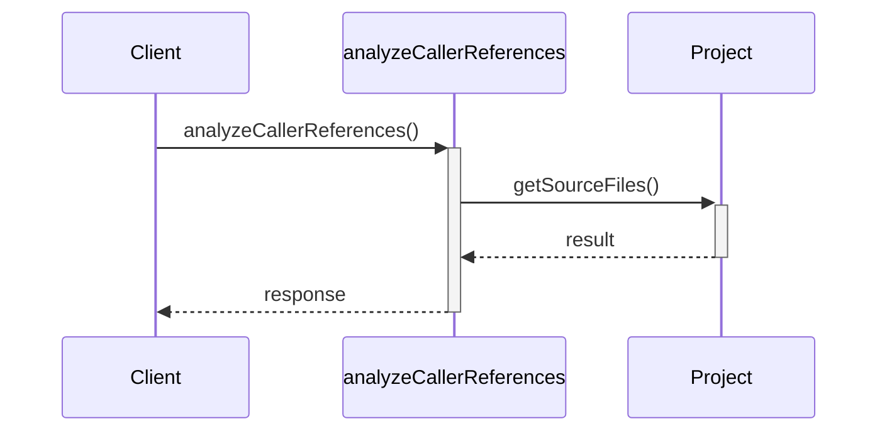
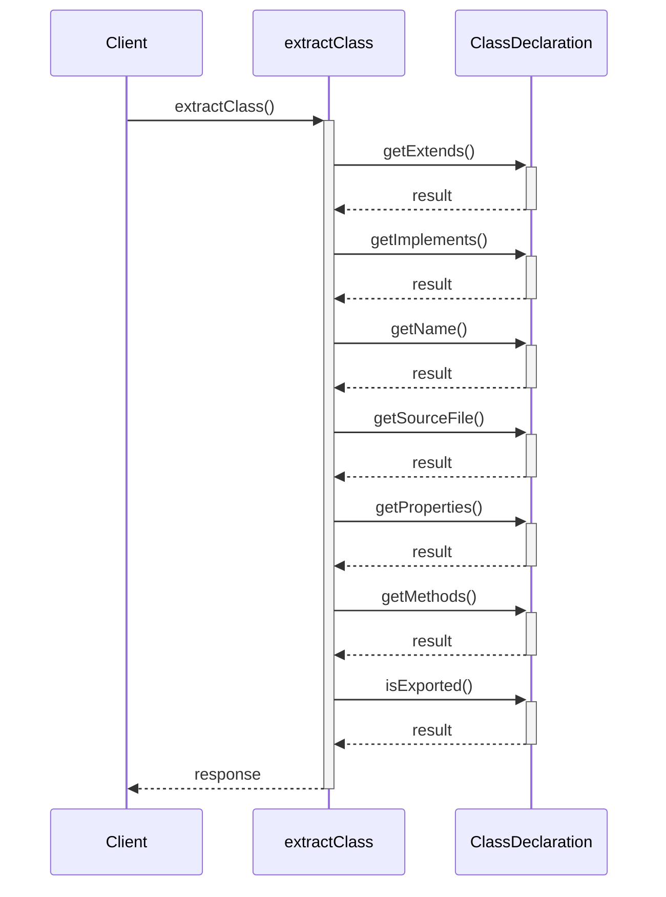
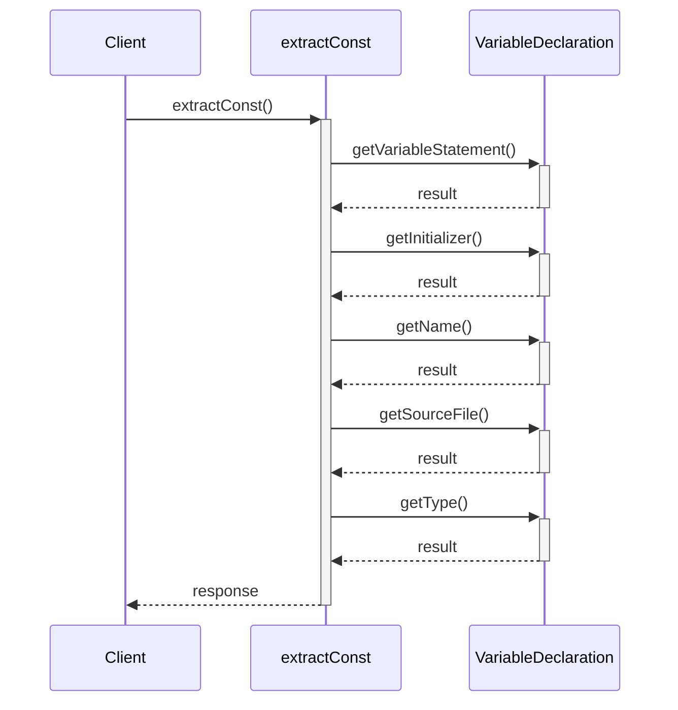
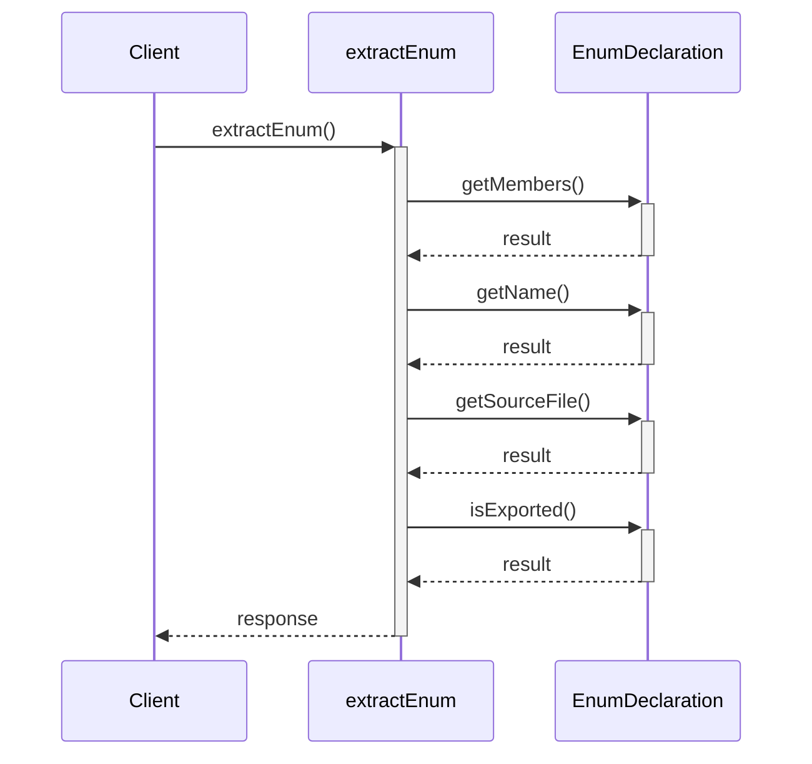
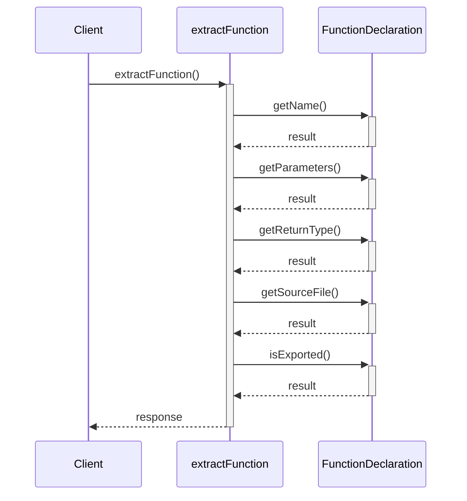
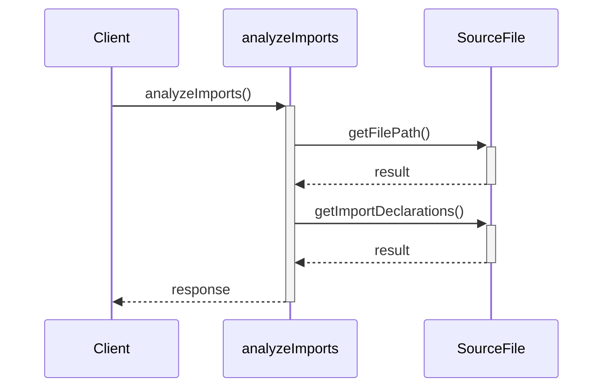
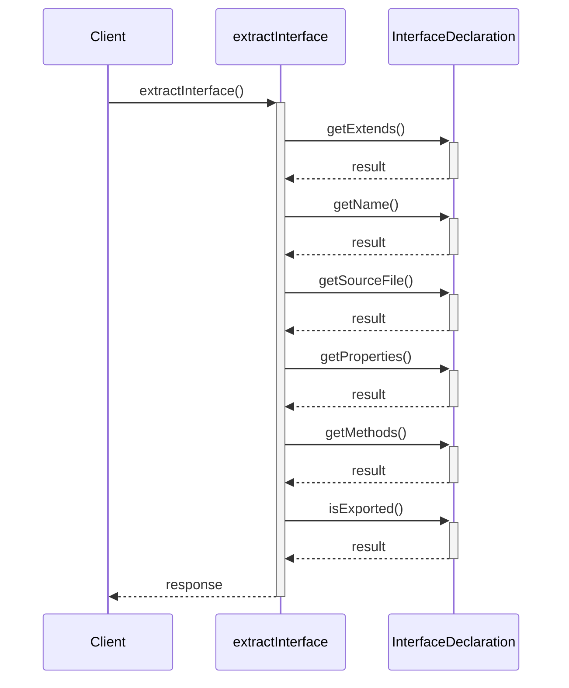
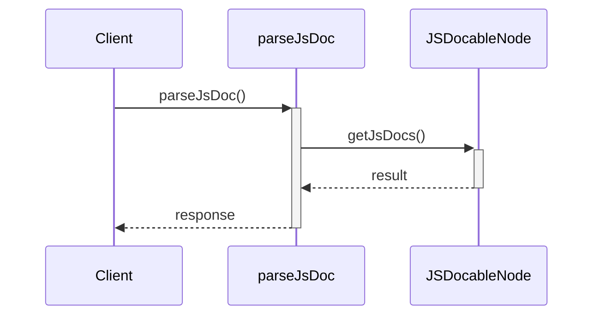
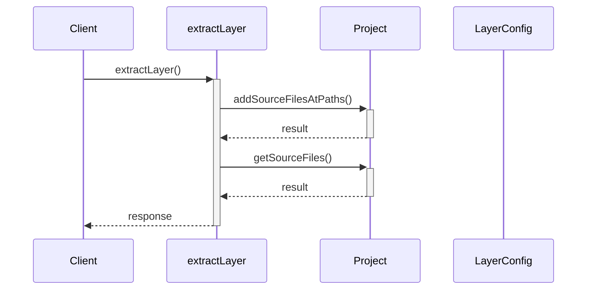
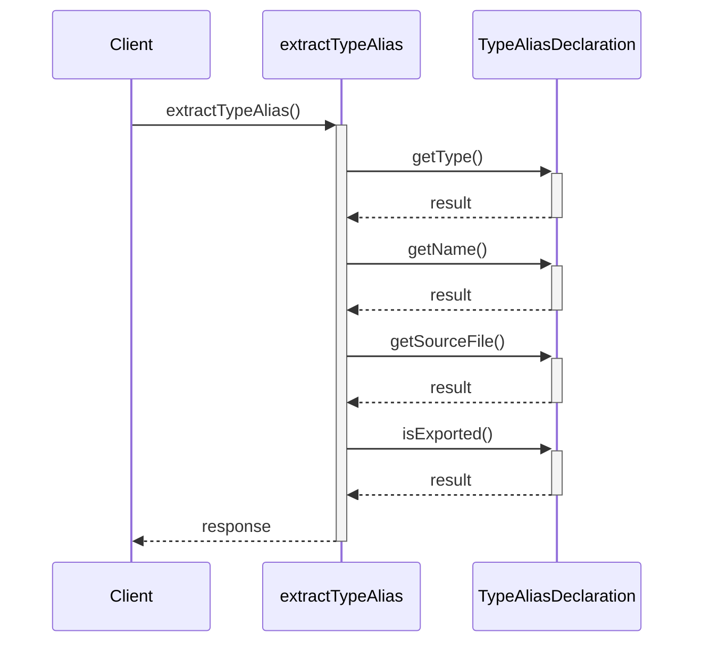

# Extractor — 抽出層 API Spec

## Responsibilities & Constraints

| Item | Detail |
| --- | --- |
| **Path** | `src/extractor/` |
| **Responsibility** | ソースコードの静的解析と情報抽出 |
| **Forbidden Imports** | `src/cli`, `src/diagram`, `src/generator` |

TypeScriptソースコードからAST解析でクラス・インターフェース・
関数・型・enum・定数を抽出する。


## Framework Extractor


### 🏗️ `ExpressExtractor`

> **File**: `express-extractor.ts`
> **Type**: Framework Extractor

FrameworkExtractorを実装するExpress.jsルート抽出器。

**Methods**

#### `extractRoutes(sourceFile: SourceFile, funcName: string): RouteInfo[]`

| Parameter | Type | Description |
| --- | --- | --- |
| `sourceFile` | `SourceFile` | — |
| `funcName` | `string` | — |

**Returns**: `RouteInfo[]` 

**Called By**

- `extractLayer()` — Extractor (`project.ts`) via `FrameworkExtractor`

#### `resolveMountPrefixes(layerSourceFiles: SourceFile[], allSourceFiles: SourceFile[], functions: FunctionInfo[]): void`

| Parameter | Type | Description |
| --- | --- | --- |
| `layerSourceFiles` | `SourceFile[]` | — |
| `allSourceFiles` | `SourceFile[]` | — |
| `functions` | `FunctionInfo[]` | — |

**Called By**

- `extractLayer()` — Extractor (`project.ts`) via `FrameworkExtractor`

### 📋 `FrameworkExtractor`

> **File**: `framework-extractor.ts`
> **Type**: Framework Extractor

フレームワーク固有のルート抽出用ストラテジーインターフェース。

**Methods**

#### `extractRoutes(sourceFile: SourceFile, funcName: string): RouteInfo[]`

| Parameter | Type | Description |
| --- | --- | --- |
| `sourceFile` | `SourceFile` | — |
| `funcName` | `string` | — |

**Returns**: `RouteInfo[]` 

#### `resolveMountPrefixes(layerSourceFiles: SourceFile[], allSourceFiles: SourceFile[], functions: FunctionInfo[]): void`

後処理ステップ: app.use() / router.use() のマウントパターンを解決し、
サブルーターのルートにプレフィックスを付与する。

| Parameter | Type | Description |
| --- | --- | --- |
| `layerSourceFiles` | `SourceFile[]` | 抽出対象レイヤー内のソースファイル群 |
| `allSourceFiles` | `SourceFile[]` | プロジェクト全体のソースファイル群（app.tsなどのapp.use()検出用） |
| `functions` | `FunctionInfo[]` | ルートを更新する対象の抽出済み関数群 |

### 🔧 `createFrameworkExtractor`

> **File**: `index.ts`

レイヤー設定に基づいてFrameworkExtractorを生成するファクトリ関数。

```ts
createFrameworkExtractor(framework?: string | undefined): FrameworkExtractor | null
```

| Parameter | Type | Description |
| --- | --- | --- |
| `framework` | `string or undefined` | フレームワーク名（例: "express"） |

**Returns**: `FrameworkExtractor | null` フレームワーク抽出器、または対応フレームワークがない場合はnull

**Called By**

- `extractLayer()` — Extractor (`project.ts`)

## Other


### 📋 `ParsedJsDoc`

> **File**: `jsdoc-parser.ts`
> **Type**: Other

説明文・引数・throws・ビジネスルールを含むJSDoc解析結果。

**Properties**

| Property | Type | Required | Description |
| --- | --- | --- | --- |
| `description` | `string` | ✓ | — |
| `params` | `Map<string, string>` | ✓ | — |
| `returns` | `string` | ✓ | — |
| `throws` | `ThrowInfo[]` | ✓ | — |
| `businessRules` | `string[]` | ✓ | — |
| `see` | `DependencyInfo[]` | ✓ | — |

### 🔧 `analyzeCallChains`

> **File**: `call-chain-analyzer.ts`

エクスポートされた全クラスのコンストラクタインジェクションによるコールチェーンを解析する。

```ts
analyzeCallChains(sourceFiles: SourceFile[]): ClassCallChain[]
```

| Parameter | Type | Description |
| --- | --- | --- |
| `sourceFiles` | `SourceFile[]` | 解析対象のソースファイル群 |

**Returns**: `ClassCallChain[]` クラスごとのコールチェーン配列

**Called By**

- `extractLayer()` — Extractor (`project.ts`)

### 🔧 `analyzeFunctionCallChains`

> **File**: `call-chain-analyzer.ts`

エクスポートされた全関数の引数ベースのコールチェーンを解析する。

```ts
analyzeFunctionCallChains(sourceFiles: SourceFile[]): ClassCallChain[]
```

| Parameter | Type | Description |
| --- | --- | --- |
| `sourceFiles` | `SourceFile[]` | 解析対象のソースファイル群 |

**Returns**: `ClassCallChain[]` 関数ごとのコールチェーン配列

**Called By**

- `extractLayer()` — Extractor (`project.ts`)

### 🔧 `analyzeCallerReferences`

> **File**: `caller-analyzer.ts`

Post-process: analyze caller references for all methods and functions.
Must be called AFTER all layers have been extracted (all source files loaded).
Mutates MethodInfo.calledBy and FunctionInfo.calledBy in-place.

```ts
analyzeCallerReferences(project: Project, extractions: LayerExtraction[], layers?: LayerConfig[] | undefined): void
```

| Parameter | Type | Description |
| --- | --- | --- |
| `project` | `Project` | — |
| `extractions` | `LayerExtraction[]` | — |
| `layers` | `LayerConfig[] or undefined` | — |

**Called By**

- `registerGenerateCommand()` — Cli (`generate.ts`)



### 🔧 `extractClass`

> **File**: `class-extractor.ts`

ts-morph ASTを使用してTypeScriptクラス宣言からメタデータを抽出する。

```ts
extractClass(classDecl: ClassDeclaration, category: string): ClassInfo
```

| Parameter | Type | Description |
| --- | --- | --- |
| `classDecl` | `ClassDeclaration` | クラス宣言ノード |
| `category` | `string` | 所属カテゴリ名 |

**Returns**: `ClassInfo` 抽出されたクラス情報

**Called By**

- `extractLayer()` — Extractor (`project.ts`)



### 🔧 `extractConst`

> **File**: `const-extractor.ts`

エクスポートされた定数宣言からメタデータを抽出する。

```ts
extractConst(decl: VariableDeclaration, category: string): ConstInfo
```

| Parameter | Type | Description |
| --- | --- | --- |
| `decl` | `VariableDeclaration` | 変数宣言ノード |
| `category` | `string` | 所属カテゴリ名 |

**Returns**: `ConstInfo` 抽出された定数情報

**Called By**

- `extractLayer()` — Extractor (`project.ts`)



### 🔧 `extractEnum`

> **File**: `enum-extractor.ts`

TypeScript enum宣言からメタデータを抽出する。

```ts
extractEnum(decl: EnumDeclaration, category: string): EnumInfo
```

| Parameter | Type | Description |
| --- | --- | --- |
| `decl` | `EnumDeclaration` | enum宣言ノード |
| `category` | `string` | 所属カテゴリ名 |

**Returns**: `EnumInfo` 抽出されたenum情報

**Called By**

- `extractLayer()` — Extractor (`project.ts`)



### 🔧 `extractFunction`

> **File**: `function-extractor.ts`

TypeScript関数宣言からメタデータを抽出する。

```ts
extractFunction(funcDecl: FunctionDeclaration, category: string): FunctionInfo
```

| Parameter | Type | Description |
| --- | --- | --- |
| `funcDecl` | `FunctionDeclaration` | 関数宣言ノード |
| `category` | `string` | 所属カテゴリ名 |

**Returns**: `FunctionInfo` 抽出された関数情報

**Called By**

- `extractLayer()` — Extractor (`project.ts`)



### 🔧 `analyzeImports`

> **File**: `import-analyzer.ts`

ソースファイルの全インポート文を解析し、対象レイヤーを特定する。

```ts
analyzeImports(sourceFile: SourceFile, layers: LayerConfig[]): DependencyInfo[]
```

| Parameter | Type | Description |
| --- | --- | --- |
| `sourceFile` | `SourceFile` | 解析対象のソースファイル |
| `layers` | `LayerConfig[]` | 全レイヤーの設定 |

**Returns**: `DependencyInfo[]` レイヤー間の依存関係情報配列

**Called By**

- `findForbiddenImports()` — Extractor (`import-analyzer.ts`)
- `extractLayer()` — Extractor (`project.ts`)



### 🔧 `findForbiddenImports`

> **File**: `import-analyzer.ts`

レイヤー設定に基づいて禁止されたクロスレイヤーインポートを検出する。

```ts
findForbiddenImports(sourceFile: SourceFile, currentLayer: LayerConfig, layers: LayerConfig[]): DependencyInfo[]
```

| Parameter | Type | Description |
| --- | --- | --- |
| `sourceFile` | `SourceFile` | 解析対象のソースファイル |
| `currentLayer` | `LayerConfig` | 自レイヤーの設定 |
| `layers` | `LayerConfig[]` | 全レイヤーの設定 |

**Returns**: `DependencyInfo[]` 禁止インポートの依存関係情報配列

**Called By**

- `extractLayer()` — Extractor (`project.ts`)

### 🔧 `extractInterface`

> **File**: `interface-extractor.ts`

TypeScriptインターフェース宣言からメタデータを抽出する。

```ts
extractInterface(ifaceDecl: InterfaceDeclaration, category: string): InterfaceInfo
```

| Parameter | Type | Description |
| --- | --- | --- |
| `ifaceDecl` | `InterfaceDeclaration` | インターフェース宣言ノード |
| `category` | `string` | 所属カテゴリ名 |

**Returns**: `InterfaceInfo` 抽出されたインターフェース情報

**Called By**

- `extractLayer()` — Extractor (`project.ts`)



### 🔧 `parseJsDoc`

> **File**: `jsdoc-parser.ts`

ts-morphノードからJSDocコメントを構造化データに変換する。

```ts
parseJsDoc(node: JSDocableNode): ParsedJsDoc
```

| Parameter | Type | Description |
| --- | --- | --- |
| `node` | `JSDocableNode` | JSDocを持つts-morphノード |

**Returns**: `ParsedJsDoc` 解析されたJSDoc情報

**Called By**

- `extractClass()` — Extractor (`class-extractor.ts`)
- `extractProperty()` — Extractor (`class-extractor.ts`)
- `extractMethod()` — Extractor (`class-extractor.ts`)
- `extractConst()` — Extractor (`const-extractor.ts`)
- `extractEnum()` — Extractor (`enum-extractor.ts`)
- `extractFunction()` — Extractor (`function-extractor.ts`)
- `extractInterface()` — Extractor (`interface-extractor.ts`)
- `extractProperty()` — Extractor (`interface-extractor.ts`)
- `extractMethodSignature()` — Extractor (`interface-extractor.ts`)
- `extractTypeAlias()` — Extractor (`type-alias-extractor.ts`)



### 🔧 `mergeParamDescriptions`

> **File**: `jsdoc-parser.ts`

JSDoc

```ts
mergeParamDescriptions(params: ParameterInfo[], jsDocParams: Map<string, string>): ParameterInfo[]
```

| Parameter | Type | Description |
| --- | --- | --- |
| `params` | `ParameterInfo[]` | 抽出済みの引数情報配列 |
| `jsDocParams` | `Map<string, string>` | 解析済みJSDoc情報（引数名と説明文のMap） |

**Returns**: `ParameterInfo[]` マージ済みの引数情報配列

**Called By**

- `extractMethod()` — Extractor (`class-extractor.ts`)
- `extractFunction()` — Extractor (`function-extractor.ts`)
- `extractMethodSignature()` — Extractor (`interface-extractor.ts`)

```mermaid
sequenceDiagram
  participant Client
  participant mergeParamDescriptions
  participant Map<string, string>
  Client->>+mergeParamDescriptions: mergeParamDescriptions()
  mergeParamDescriptions->>+Map<string, string>: get()
  Map<string, string>-->>-mergeParamDescriptions: result
  mergeParamDescriptions-->>-Client: response
```

### 🔧 `createExtractorProject`

> **File**: `project.ts`

ソースコード解析用のts-morph Projectインスタンスを作成する。

```ts
createExtractorProject(sourceRoot: string, tsConfigPath?: string | undefined): Project
```

| Parameter | Type | Description |
| --- | --- | --- |
| `sourceRoot` | `string` | ソースルートディレクトリ |
| `tsConfigPath` | `string or undefined` | tsconfig.jsonのパス（省略可） |

**Returns**: `Project` 設定済みのProjectインスタンス

**Called By**

- `registerDiagramCommand()` — Cli (`diagram.ts`)
- `registerDriftCommand()` — Cli (`drift.ts`)
- `registerGenerateCommand()` — Cli (`generate.ts`)

### 🔧 `extractLayer`

> **File**: `project.ts`

単一アーキテクチャレイヤーから全コンポーネントを抽出する。

```ts
extractLayer(project: Project, layer: LayerConfig, allLayers?: LayerConfig[] | undefined, sourceRoot?: string | undefined): LayerExtraction
```

| Parameter | Type | Description |
| --- | --- | --- |
| `project` | `Project` | ts-morph Projectインスタンス |
| `layer` | `LayerConfig` | レイヤー設定 |
| `allLayers` | `LayerConfig[] or undefined` | 全レイヤーの設定 |
| `sourceRoot` | `string or undefined` | ソースルートディレクトリ（フレームワーク抽出時に使用） |

**Returns**: `LayerExtraction` レイヤーの抽出結果

**Called By**

- `registerDiagramCommand()` — Cli (`diagram.ts`)
- `registerDriftCommand()` — Cli (`drift.ts`)
- `registerGenerateCommand()` — Cli (`generate.ts`)



### 🔧 `extractTypeAlias`

> **File**: `type-alias-extractor.ts`

TypeScript型エイリアス宣言からメタデータを抽出する。

```ts
extractTypeAlias(decl: TypeAliasDeclaration, category: string): TypeAliasInfo
```

| Parameter | Type | Description |
| --- | --- | --- |
| `decl` | `TypeAliasDeclaration` | 型エイリアス宣言ノード |
| `category` | `string` | 所属カテゴリ名 |

**Returns**: `TypeAliasInfo` 抽出された型エイリアス情報

**Called By**

- `extractLayer()` — Extractor (`project.ts`)


