# Extractor — 抽出層 API仕様

## 責務と制約

| 項目 | 詳細 |
| --- | --- |
| **パス** | `src/extractor/` |
| **責務** | ソースコードの静的解析と情報抽出 |
| **禁止インポート** | `src/cli`, `src/diagram`, `src/generator` |

TypeScriptソースコードからAST解析でクラス・インターフェース・
関数・型・enum・定数を抽出する。

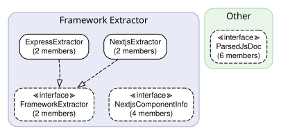

## Extractor/Frameworkのコンポーネント

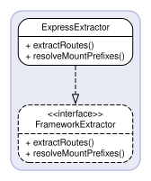

### 🏗️ `ExpressExtractor` クラス

> **ファイル**: `express-extractor.ts`
> **型**: Framework Extractor

FrameworkExtractorを実装するExpress.jsルート抽出器。

**メソッド**

#### `extractRoutes` メソッド

```ts
extractRoutes(sourceFile: SourceFile, funcName: string): RouteInfo[]
```

| 引数 | 型 | 説明 |
| --- | --- | --- |
| `sourceFile` | `SourceFile` | — |
| `funcName` | `string` | — |

**戻り値**: `RouteInfo[]` 

**呼び出し元**

- `extractLayer()` — Extractor (`project.ts`) via `FrameworkExtractor`

#### `resolveMountPrefixes` メソッド

```ts
resolveMountPrefixes(layerSourceFiles: SourceFile[], allSourceFiles: SourceFile[], functions: FunctionInfo[]): void
```

| 引数 | 型 | 説明 |
| --- | --- | --- |
| `layerSourceFiles` | `SourceFile[]` | — |
| `allSourceFiles` | `SourceFile[]` | — |
| `functions` | `FunctionInfo[]` | — |

**呼び出し元**

- `extractLayer()` — Extractor (`project.ts`) via `FrameworkExtractor`

### 🏗️ `NextjsExtractor` クラス

> **ファイル**: `nextjs-extractor.ts`
> **型**: Framework Extractor

Next.js App Router route handler extractor.

Detects exported HTTP method functions (GET, POST, etc.) in route.ts files,
page.tsx/layout.tsx structure, "use client"/"use server" directives,
and Server Action functions.

**メソッド**

#### `extractRoutes` メソッド

```ts
extractRoutes(sourceFile: SourceFile, funcName: string): RouteInfo[]
```

| 引数 | 型 | 説明 |
| --- | --- | --- |
| `sourceFile` | `SourceFile` | — |
| `funcName` | `string` | — |

**戻り値**: `RouteInfo[]` 

**呼び出し元**

- `extractLayer()` — Extractor (`project.ts`) via `FrameworkExtractor`

#### `resolveMountPrefixes` メソッド

```ts
resolveMountPrefixes(_layerSourceFiles: SourceFile[], _allSourceFiles: SourceFile[], _functions: FunctionInfo[]): void
```

| 引数 | 型 | 説明 |
| --- | --- | --- |
| `_layerSourceFiles` | `SourceFile[]` | — |
| `_allSourceFiles` | `SourceFile[]` | — |
| `_functions` | `FunctionInfo[]` | — |

**呼び出し元**

- `extractLayer()` — Extractor (`project.ts`) via `FrameworkExtractor`

### 📋 `FrameworkExtractor` インターフェース

> **ファイル**: `framework-extractor.ts`
> **型**: Framework Extractor

フレームワーク固有のルート抽出用ストラテジーインターフェース。

**メソッド**

#### `extractRoutes` メソッド

```ts
extractRoutes(sourceFile: SourceFile, funcName: string): RouteInfo[]
```

| 引数 | 型 | 説明 |
| --- | --- | --- |
| `sourceFile` | `SourceFile` | — |
| `funcName` | `string` | — |

**戻り値**: `RouteInfo[]` 

#### `resolveMountPrefixes` メソッド

後処理ステップ: app.use() / router.use() のマウントパターンを解決し、
サブルーターのルートにプレフィックスを付与する。

```ts
resolveMountPrefixes(layerSourceFiles: SourceFile[], allSourceFiles: SourceFile[], functions: FunctionInfo[]): void
```

| 引数 | 型 | 説明 |
| --- | --- | --- |
| `layerSourceFiles` | `SourceFile[]` | 抽出対象レイヤー内のソースファイル群 |
| `allSourceFiles` | `SourceFile[]` | プロジェクト全体のソースファイル群（app.tsなどのapp.use()検出用） |
| `functions` | `FunctionInfo[]` | ルートを更新する対象の抽出済み関数群 |

### 📋 `NextjsComponentInfo` インターフェース

> **ファイル**: `nextjs-extractor.ts`
> **型**: Framework Extractor

Metadata for a Next.js component file.

**プロパティ**

| プロパティ | 型 | 必須 | 説明 |
| --- | --- | --- | --- |
| `filePath` | `string` | ✓ | — |
| `fileType` | `"page" or "layout" or "route"` | ✓ | — |
| `componentType` | `"server" or "client" or "server-action"` | ✓ | — |
| `routePath` | `string` | ✓ | — |

### 🔧 `createFrameworkExtractor` 関数

> **ファイル**: `index.ts`

レイヤー設定に基づいてFrameworkExtractorを生成するファクトリ関数。

```ts
createFrameworkExtractor(framework?: string | undefined): FrameworkExtractor | null
```

| 引数 | 型 | 説明 |
| --- | --- | --- |
| `framework` | `string or undefined` | フレームワーク名（例: "express"） |

**戻り値**: `FrameworkExtractor | null` フレームワーク抽出器、または対応フレームワークがない場合はnull

**呼び出し元**

- `extractLayer()` — Extractor (`project.ts`)

### 🔧 `classifyNextjsComponent` 関数

> **ファイル**: `nextjs-extractor.ts`

Extract page and layout metadata from a Next.js App Router source file.
Returns component type classification: Server Component, Client Component, or Server Action.

```ts
classifyNextjsComponent(sourceFile: SourceFile): NextjsComponentInfo | null
```

| 引数 | 型 | 説明 |
| --- | --- | --- |
| `sourceFile` | `SourceFile` | — |

**戻り値**: `NextjsComponentInfo | null` 

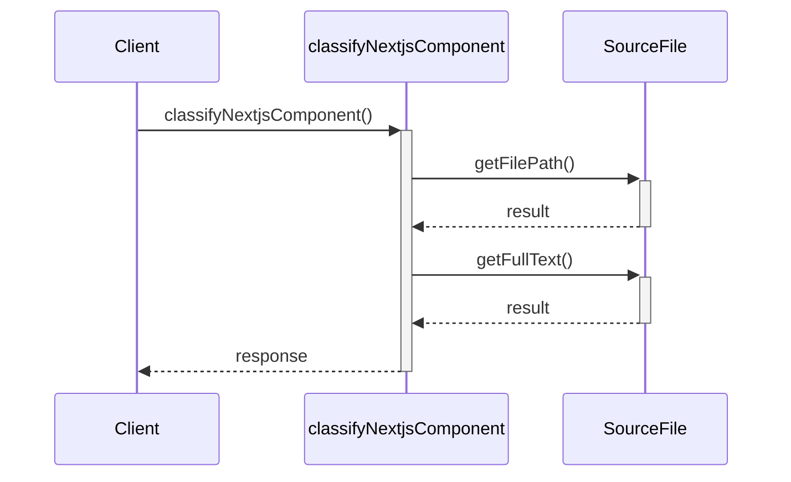

### 🔧 `extractServerActions` 関数

> **ファイル**: `nextjs-extractor.ts`

Extract Server Action functions from a file with "use server" directive.

```ts
extractServerActions(sourceFile: SourceFile): string[]
```

| 引数 | 型 | 説明 |
| --- | --- | --- |
| `sourceFile` | `SourceFile` | — |

**戻り値**: `string[]` 

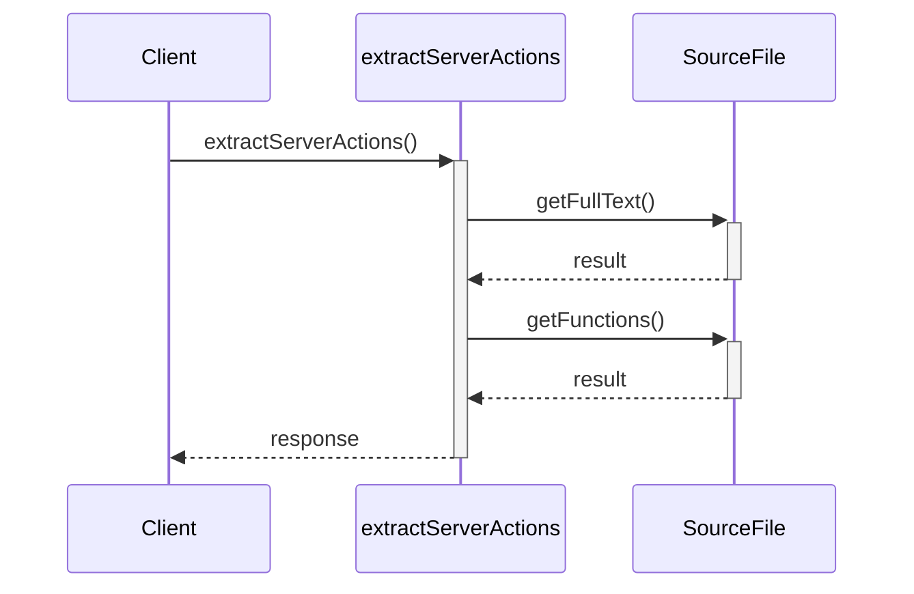

## Extractorのコンポーネント

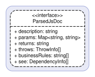

### 📋 `ParsedJsDoc` インターフェース

> **ファイル**: `jsdoc-parser.ts`
> **型**: Other

説明文・引数・throws・ビジネスルールを含むJSDoc解析結果。

**プロパティ**

| プロパティ | 型 | 必須 | 説明 |
| --- | --- | --- | --- |
| `description` | `string` | ✓ | — |
| `params` | `Map<string, string>` | ✓ | — |
| `returns` | `string` | ✓ | — |
| `throws` | `ThrowInfo[]` | ✓ | — |
| `businessRules` | `string[]` | ✓ | — |
| `see` | `DependencyInfo[]` | ✓ | — |

### 🔧 `analyzeCallChains` 関数

> **ファイル**: `call-chain-analyzer.ts`

エクスポートされた全クラスのコンストラクタインジェクションによるコールチェーンを解析する。

```ts
analyzeCallChains(sourceFiles: SourceFile[]): ClassCallChain[]
```

| 引数 | 型 | 説明 |
| --- | --- | --- |
| `sourceFiles` | `SourceFile[]` | 解析対象のソースファイル群 |

**戻り値**: `ClassCallChain[]` クラスごとのコールチェーン配列

**呼び出し元**

- `extractLayer()` — Extractor (`project.ts`)

### 🔧 `analyzeFunctionCallChains` 関数

> **ファイル**: `call-chain-analyzer.ts`

エクスポートされた全関数の引数ベースのコールチェーンを解析する。

```ts
analyzeFunctionCallChains(sourceFiles: SourceFile[]): ClassCallChain[]
```

| 引数 | 型 | 説明 |
| --- | --- | --- |
| `sourceFiles` | `SourceFile[]` | 解析対象のソースファイル群 |

**戻り値**: `ClassCallChain[]` 関数ごとのコールチェーン配列

**呼び出し元**

- `extractLayer()` — Extractor (`project.ts`)

### 🔧 `analyzeCallerReferences` 関数

> **ファイル**: `caller-analyzer.ts`

Post-process: analyze caller references for all methods and functions.
Must be called AFTER all layers have been extracted (all source files loaded).
Mutates MethodInfo.calledBy and FunctionInfo.calledBy in-place.

```ts
analyzeCallerReferences(project: Project, extractions: LayerExtraction[], layers?: LayerConfig[] | undefined): void
```

| 引数 | 型 | 説明 |
| --- | --- | --- |
| `project` | `Project` | — |
| `extractions` | `LayerExtraction[]` | — |
| `layers` | `LayerConfig[] or undefined` | — |

**呼び出し元**

- `registerFeaturesCommand()` — Cli (`features.ts`)
- `registerGenerateCommand()` — Cli (`generate.ts`)

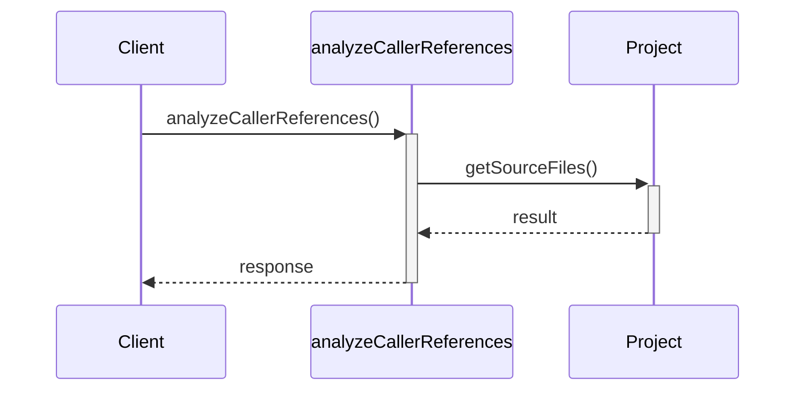

### 🔧 `extractClass` 関数

> **ファイル**: `class-extractor.ts`

ts-morph ASTを使用してTypeScriptクラス宣言からメタデータを抽出する。

```ts
extractClass(classDecl: ClassDeclaration, category: string): ClassInfo
```

| 引数 | 型 | 説明 |
| --- | --- | --- |
| `classDecl` | `ClassDeclaration` | クラス宣言ノード |
| `category` | `string` | 所属カテゴリ名 |

**戻り値**: `ClassInfo` 抽出されたクラス情報

**呼び出し元**

- `extractLayer()` — Extractor (`project.ts`)

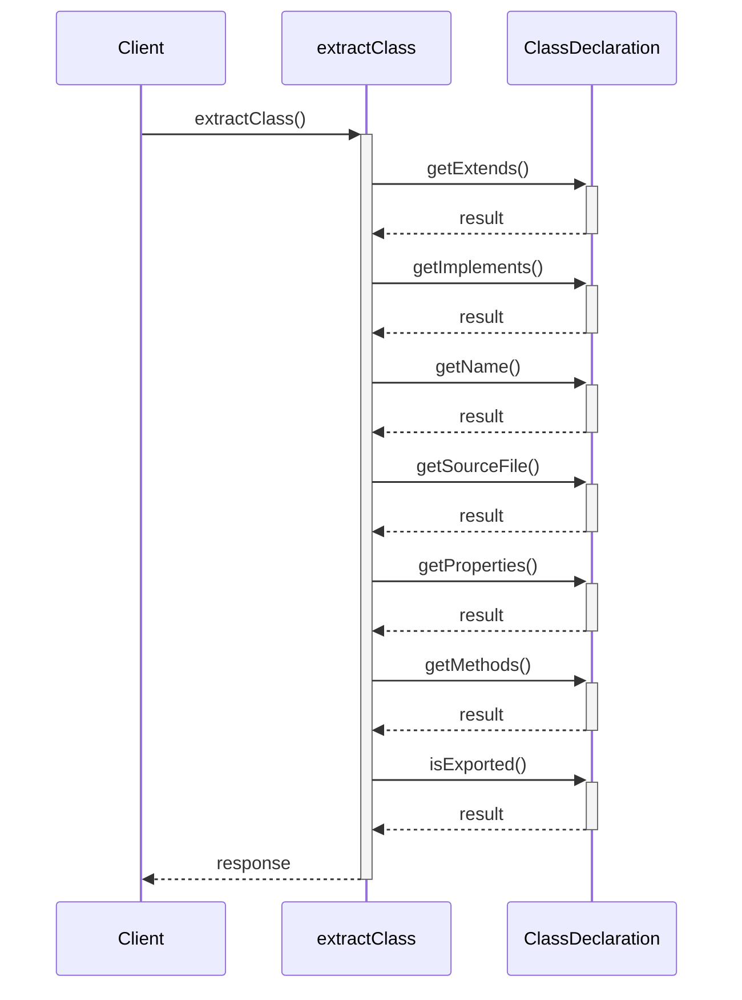

### 🔧 `extractConst` 関数

> **ファイル**: `const-extractor.ts`

エクスポートされた定数宣言からメタデータを抽出する。

```ts
extractConst(decl: VariableDeclaration, category: string): ConstInfo
```

| 引数 | 型 | 説明 |
| --- | --- | --- |
| `decl` | `VariableDeclaration` | 変数宣言ノード |
| `category` | `string` | 所属カテゴリ名 |

**戻り値**: `ConstInfo` 抽出された定数情報

**呼び出し元**

- `extractLayer()` — Extractor (`project.ts`)

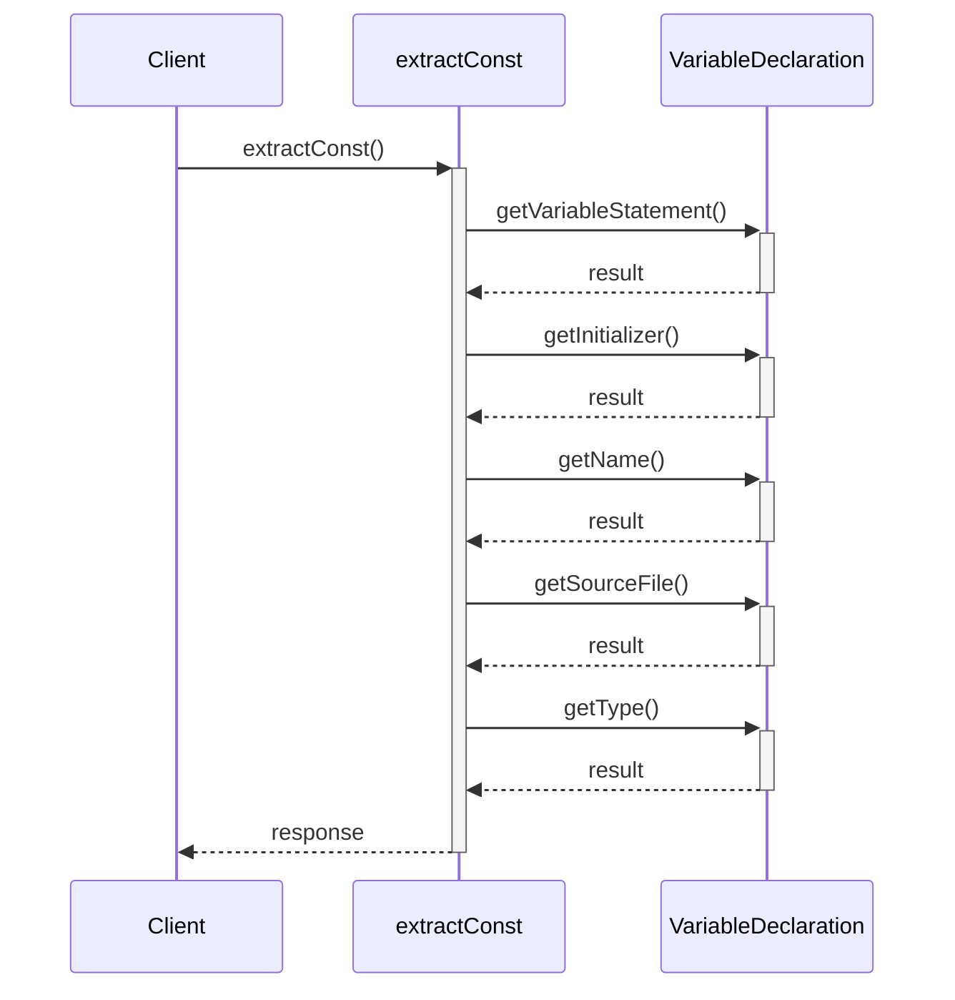

### 🔧 `extractEnum` 関数

> **ファイル**: `enum-extractor.ts`

TypeScript enum宣言からメタデータを抽出する。

```ts
extractEnum(decl: EnumDeclaration, category: string): EnumInfo
```

| 引数 | 型 | 説明 |
| --- | --- | --- |
| `decl` | `EnumDeclaration` | enum宣言ノード |
| `category` | `string` | 所属カテゴリ名 |

**戻り値**: `EnumInfo` 抽出されたenum情報

**呼び出し元**

- `extractLayer()` — Extractor (`project.ts`)

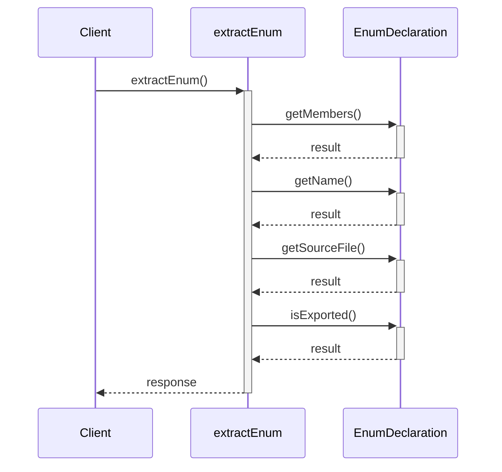

### 🔧 `extractFunction` 関数

> **ファイル**: `function-extractor.ts`

TypeScript関数宣言からメタデータを抽出する。

```ts
extractFunction(funcDecl: FunctionDeclaration, category: string): FunctionInfo
```

| 引数 | 型 | 説明 |
| --- | --- | --- |
| `funcDecl` | `FunctionDeclaration` | 関数宣言ノード |
| `category` | `string` | 所属カテゴリ名 |

**戻り値**: `FunctionInfo` 抽出された関数情報

**呼び出し元**

- `extractLayer()` — Extractor (`project.ts`)

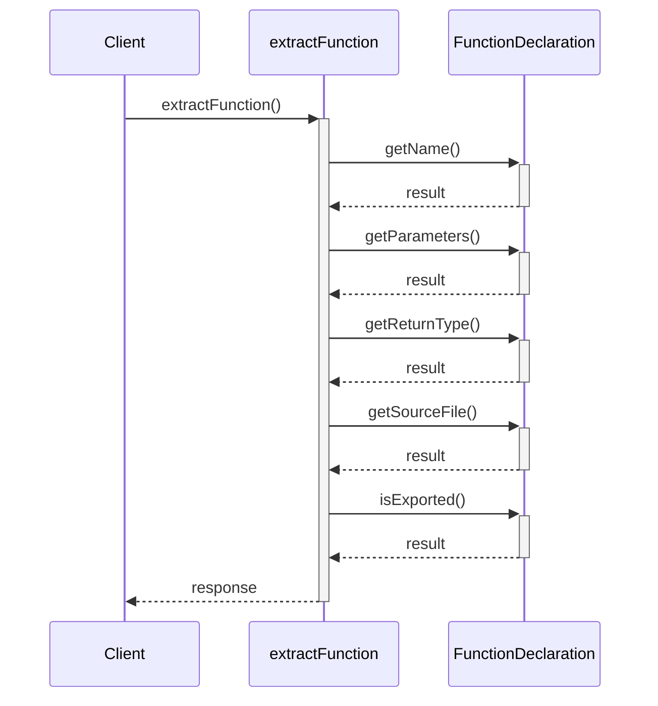

### 🔧 `analyzeImports` 関数

> **ファイル**: `import-analyzer.ts`

ソースファイルの全インポート文を解析し、対象レイヤーを特定する。

```ts
analyzeImports(sourceFile: SourceFile, layers: LayerConfig[]): DependencyInfo[]
```

| 引数 | 型 | 説明 |
| --- | --- | --- |
| `sourceFile` | `SourceFile` | 解析対象のソースファイル |
| `layers` | `LayerConfig[]` | 全レイヤーの設定 |

**戻り値**: `DependencyInfo[]` レイヤー間の依存関係情報配列

**呼び出し元**

- `findForbiddenImports()` — Extractor (`import-analyzer.ts`)
- `extractLayer()` — Extractor (`project.ts`)

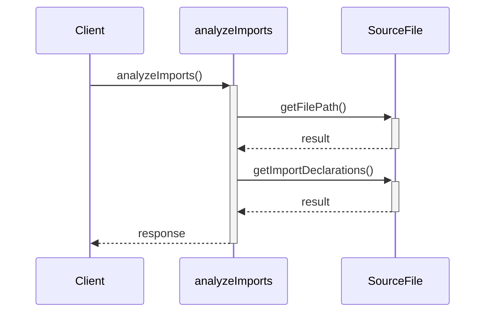

### 🔧 `findForbiddenImports` 関数

> **ファイル**: `import-analyzer.ts`

レイヤー設定に基づいて禁止されたクロスレイヤーインポートを検出する。

```ts
findForbiddenImports(sourceFile: SourceFile, currentLayer: LayerConfig, layers: LayerConfig[]): DependencyInfo[]
```

| 引数 | 型 | 説明 |
| --- | --- | --- |
| `sourceFile` | `SourceFile` | 解析対象のソースファイル |
| `currentLayer` | `LayerConfig` | 自レイヤーの設定 |
| `layers` | `LayerConfig[]` | 全レイヤーの設定 |

**戻り値**: `DependencyInfo[]` 禁止インポートの依存関係情報配列

**呼び出し元**

- `extractLayer()` — Extractor (`project.ts`)

### 🔧 `extractInterface` 関数

> **ファイル**: `interface-extractor.ts`

TypeScriptインターフェース宣言からメタデータを抽出する。

```ts
extractInterface(ifaceDecl: InterfaceDeclaration, category: string): InterfaceInfo
```

| 引数 | 型 | 説明 |
| --- | --- | --- |
| `ifaceDecl` | `InterfaceDeclaration` | インターフェース宣言ノード |
| `category` | `string` | 所属カテゴリ名 |

**戻り値**: `InterfaceInfo` 抽出されたインターフェース情報

**呼び出し元**

- `extractLayer()` — Extractor (`project.ts`)

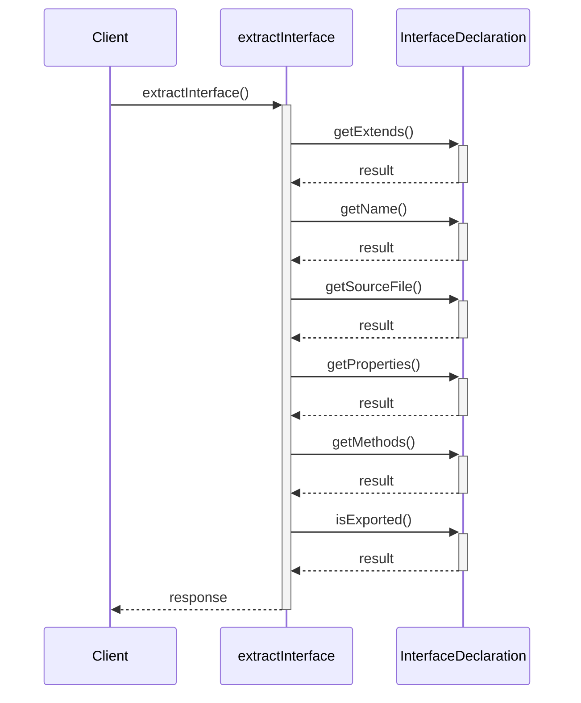

### 🔧 `parseJsDoc` 関数

> **ファイル**: `jsdoc-parser.ts`

ts-morphノードからJSDocコメントを構造化データに変換する。

```ts
parseJsDoc(node: JSDocableNode): ParsedJsDoc
```

| 引数 | 型 | 説明 |
| --- | --- | --- |
| `node` | `JSDocableNode` | JSDocを持つts-morphノード |

**戻り値**: `ParsedJsDoc` 解析されたJSDoc情報

**呼び出し元**

- `extractClass()` — Extractor (`class-extractor.ts`)
- `extractProperty()` — Extractor (`class-extractor.ts`)
- `extractMethod()` — Extractor (`class-extractor.ts`)
- `extractConst()` — Extractor (`const-extractor.ts`)
- `extractEnum()` — Extractor (`enum-extractor.ts`)
- `extractFunction()` — Extractor (`function-extractor.ts`)
- `extractInterface()` — Extractor (`interface-extractor.ts`)
- `extractProperty()` — Extractor (`interface-extractor.ts`)
- `extractMethodSignature()` — Extractor (`interface-extractor.ts`)
- `extractTypeAlias()` — Extractor (`type-alias-extractor.ts`)

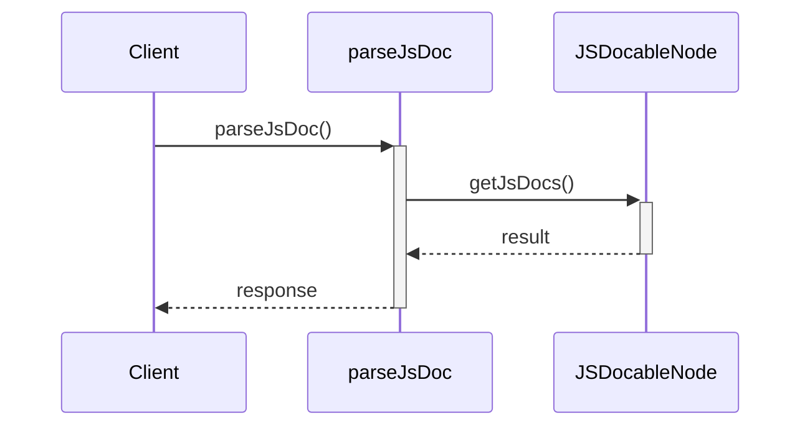

### 🔧 `mergeParamDescriptions` 関数

> **ファイル**: `jsdoc-parser.ts`

JSDoc

```ts
mergeParamDescriptions(params: ParameterInfo[], jsDocParams: Map<string, string>): ParameterInfo[]
```

| 引数 | 型 | 説明 |
| --- | --- | --- |
| `params` | `ParameterInfo[]` | 抽出済みの引数情報配列 |
| `jsDocParams` | `Map<string, string>` | 解析済みJSDoc情報（引数名と説明文のMap） |

**戻り値**: `ParameterInfo[]` マージ済みの引数情報配列

**呼び出し元**

- `extractMethod()` — Extractor (`class-extractor.ts`)
- `extractFunction()` — Extractor (`function-extractor.ts`)
- `extractMethodSignature()` — Extractor (`interface-extractor.ts`)

```mermaid
sequenceDiagram
  participant Client
  participant mergeParamDescriptions
  participant Map<string, string>
  Client->>+mergeParamDescriptions: mergeParamDescriptions()
  mergeParamDescriptions->>+Map<string, string>: get()
  Map<string, string>-->>-mergeParamDescriptions: result
  mergeParamDescriptions-->>-Client: response
```

### 🔧 `createExtractorProject` 関数

> **ファイル**: `project.ts`

ソースコード解析用のts-morph Projectインスタンスを作成する。

```ts
createExtractorProject(sourceRoot: string, tsConfigPath?: string | undefined): Project
```

| 引数 | 型 | 説明 |
| --- | --- | --- |
| `sourceRoot` | `string` | ソースルートディレクトリ |
| `tsConfigPath` | `string or undefined` | tsconfig.jsonのパス（省略可） |

**戻り値**: `Project` 設定済みのProjectインスタンス

**呼び出し元**

- `registerDiagramCommand()` — Cli (`diagram.ts`)
- `registerDriftCommand()` — Cli (`drift.ts`)
- `registerFeaturesCommand()` — Cli (`features.ts`)
- `registerGenerateCommand()` — Cli (`generate.ts`)

### 🔧 `extractLayer` 関数

> **ファイル**: `project.ts`

単一アーキテクチャレイヤーから全コンポーネントを抽出する。

```ts
extractLayer(project: Project, layer: LayerConfig, allLayers?: LayerConfig[] | undefined, sourceRoot?: string | undefined): LayerExtraction
```

| 引数 | 型 | 説明 |
| --- | --- | --- |
| `project` | `Project` | ts-morph Projectインスタンス |
| `layer` | `LayerConfig` | レイヤー設定 |
| `allLayers` | `LayerConfig[] or undefined` | 全レイヤーの設定 |
| `sourceRoot` | `string or undefined` | ソースルートディレクトリ（フレームワーク抽出時に使用） |

**戻り値**: `LayerExtraction` レイヤーの抽出結果

**呼び出し元**

- `registerDiagramCommand()` — Cli (`diagram.ts`)
- `registerDriftCommand()` — Cli (`drift.ts`)
- `registerFeaturesCommand()` — Cli (`features.ts`)
- `registerGenerateCommand()` — Cli (`generate.ts`)

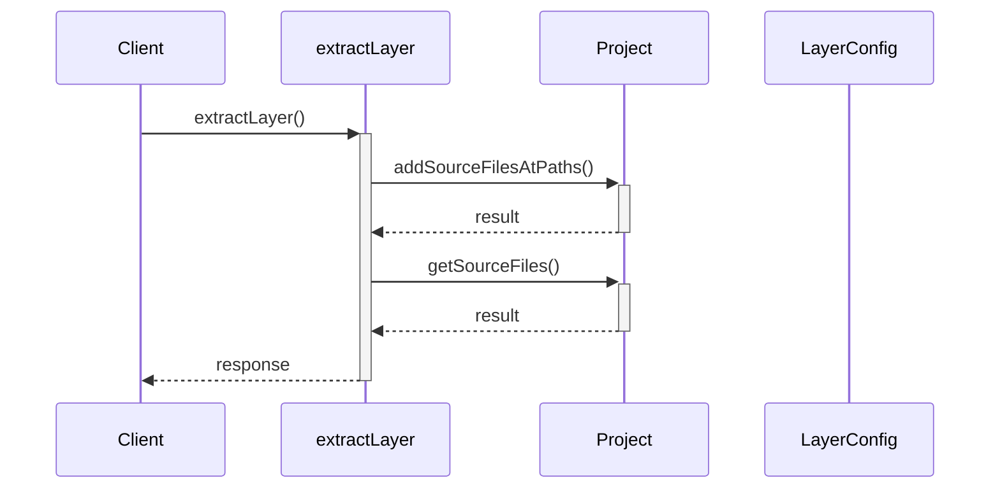

### 🔧 `extractTypeAlias` 関数

> **ファイル**: `type-alias-extractor.ts`

TypeScript型エイリアス宣言からメタデータを抽出する。

```ts
extractTypeAlias(decl: TypeAliasDeclaration, category: string): TypeAliasInfo
```

| 引数 | 型 | 説明 |
| --- | --- | --- |
| `decl` | `TypeAliasDeclaration` | 型エイリアス宣言ノード |
| `category` | `string` | 所属カテゴリ名 |

**戻り値**: `TypeAliasInfo` 抽出された型エイリアス情報

**呼び出し元**

- `extractLayer()` — Extractor (`project.ts`)

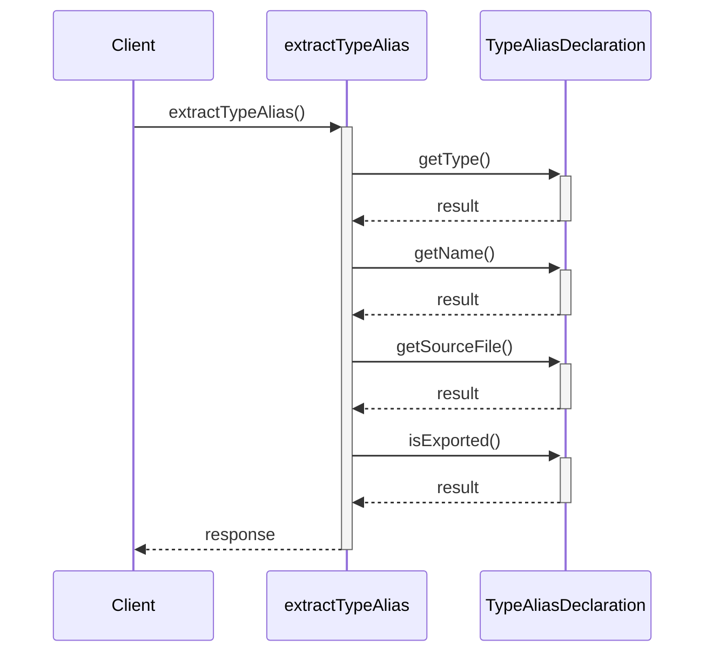
