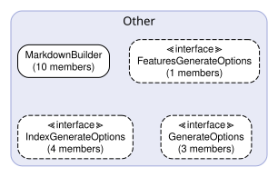
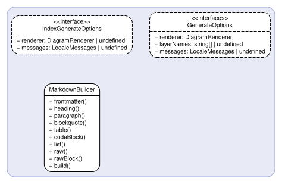

# Generator — 生成層 API Spec

## Responsibilities & Constraints

| Item | Detail |
| --- | --- |
| **Path** | `src/generator/` |
| **Responsibility** | Markdownドキュメント生成 |
| **Forbidden Imports** | `src/cli`, `src/config`, `src/extractor` |

抽出結果からMarkdownドキュメントを生成。
index.md（全体概要）とレイヤー別ドキュメントを出力。



## Other



### 🏗️ `MarkdownBuilder`

> **File**: `markdown-builder.ts`
> **Type**: Other

**Methods**

#### `frontmatter(data: Record<string, string>): this`

| Parameter | Type | Description |
| --- | --- | --- |
| `data` | `Record<string, string>` | — |

**Returns**: `this` 

**Called By**

- `generateIndexMd()` — Generator (`index-generator.ts`)
- `generateLayerMd()` — Generator (`layer-generator.ts`)

#### `heading(level: number, text: string): this`

| Parameter | Type | Description |
| --- | --- | --- |
| `level` | `number` | — |
| `text` | `string` | — |

**Returns**: `this` 

**Called By**

- `generateIndexMd()` — Generator (`index-generator.ts`)
- `generateLayerMd()` — Generator (`layer-generator.ts`)
- `renderClass()` — Generator (`layer-generator.ts`)
- `renderInterface()` — Generator (`layer-generator.ts`)
- `renderFunction()` — Generator (`layer-generator.ts`)
- `renderMethod()` — Generator (`layer-generator.ts`)
- `renderMethodSignature()` — Generator (`layer-generator.ts`)
- `renderTypeAlias()` — Generator (`layer-generator.ts`)
- `renderEnum()` — Generator (`layer-generator.ts`)
- `renderConst()` — Generator (`layer-generator.ts`)

#### `paragraph(text: string): this`

| Parameter | Type | Description |
| --- | --- | --- |
| `text` | `string` | — |

**Returns**: `this` 

**Called By**

- `generateIndexMd()` — Generator (`index-generator.ts`)
- `generateLayerMd()` — Generator (`layer-generator.ts`)
- `renderClass()` — Generator (`layer-generator.ts`)
- `renderInterface()` — Generator (`layer-generator.ts`)
- `renderFunction()` — Generator (`layer-generator.ts`)
- `renderCalledBy()` — Generator (`layer-generator.ts`)
- `renderMethod()` — Generator (`layer-generator.ts`)
- `renderMethodSignature()` — Generator (`layer-generator.ts`)
- `renderTypeAlias()` — Generator (`layer-generator.ts`)
- `renderEnum()` — Generator (`layer-generator.ts`)
- `renderConst()` — Generator (`layer-generator.ts`)

#### `blockquote(text: string): this`

| Parameter | Type | Description |
| --- | --- | --- |
| `text` | `string` | — |

**Returns**: `this` 

**Called By**

- `renderClass()` — Generator (`layer-generator.ts`)
- `renderInterface()` — Generator (`layer-generator.ts`)
- `renderFunction()` — Generator (`layer-generator.ts`)
- `renderTypeAlias()` — Generator (`layer-generator.ts`)
- `renderEnum()` — Generator (`layer-generator.ts`)
- `renderConst()` — Generator (`layer-generator.ts`)

#### `table(headers: string[], rows: string[][]): this`

| Parameter | Type | Description |
| --- | --- | --- |
| `headers` | `string[]` | — |
| `rows` | `string[][]` | — |

**Returns**: `this` 

**Called By**

- `generateIndexMd()` — Generator (`index-generator.ts`)
- `generateLayerMd()` — Generator (`layer-generator.ts`)
- `renderClass()` — Generator (`layer-generator.ts`)
- `renderInterface()` — Generator (`layer-generator.ts`)
- `renderFunction()` — Generator (`layer-generator.ts`)
- `renderMethod()` — Generator (`layer-generator.ts`)
- `renderMethodSignature()` — Generator (`layer-generator.ts`)
- `renderTypeAlias()` — Generator (`layer-generator.ts`)
- `renderEnum()` — Generator (`layer-generator.ts`)

#### `codeBlock(code: string, lang?: string): this`

| Parameter | Type | Description |
| --- | --- | --- |
| `code` | `string` | — |
| `lang` | `string` | — |

**Returns**: `this` 

**Called By**

- `renderFunction()` — Generator (`layer-generator.ts`)
- `renderTypeAlias()` — Generator (`layer-generator.ts`)
- `renderConst()` — Generator (`layer-generator.ts`)

#### `list(items: string[]): this`

| Parameter | Type | Description |
| --- | --- | --- |
| `items` | `string[]` | — |

**Returns**: `this` 

**Called By**

- `renderClass()` — Generator (`layer-generator.ts`)
- `renderFunction()` — Generator (`layer-generator.ts`)
- `renderCalledBy()` — Generator (`layer-generator.ts`)
- `renderMethod()` — Generator (`layer-generator.ts`)

#### `raw(text: string): this`

| Parameter | Type | Description |
| --- | --- | --- |
| `text` | `string` | — |

**Returns**: `this` 

#### `rawBlock(text: string): this`

| Parameter | Type | Description |
| --- | --- | --- |
| `text` | `string` | — |

**Returns**: `this` 

**Called By**

- `generateIndexMd()` — Generator (`index-generator.ts`)
- `generateLayerMd()` — Generator (`layer-generator.ts`)
- `renderGroupDiagramAndItems()` — Generator (`layer-generator.ts`)
- `renderFunction()` — Generator (`layer-generator.ts`)
- `renderMethodSequenceDiagram()` — Generator (`layer-generator.ts`)

#### `build(): string`

**Returns**: `string` 

**Called By**

- `generateIndexMd()` — Generator (`index-generator.ts`)
- `generateLayerMd()` — Generator (`layer-generator.ts`)

### 📋 `IndexGenerateOptions`

> **File**: `index-generator.ts`
> **Type**: Other

**Properties**

| Property | Type | Required | Description |
| --- | --- | --- | --- |
| `renderer` | `DiagramRenderer or undefined` | — | — |

### 📋 `GenerateOptions`

> **File**: `layer-generator.ts`
> **Type**: Other

**Properties**

| Property | Type | Required | Description |
| --- | --- | --- | --- |
| `renderer` | `DiagramRenderer` | ✓ | — |
| `layerNames` | `string[] or undefined` | — | Ordered layer names (inner → outer) for dependency direction checks |

### 🔧 `kindEmoji`

> **File**: `emoji.ts`

```ts
kindEmoji(kind: ObjectKind): string
```

| Parameter | Type | Description |
| --- | --- | --- |
| `kind` | `ObjectKind` | — |

**Returns**: `string` 

**Called By**

- `renderClass()` — Generator (`layer-generator.ts`)
- `renderInterface()` — Generator (`layer-generator.ts`)
- `renderFunction()` — Generator (`layer-generator.ts`)
- `renderTypeAlias()` — Generator (`layer-generator.ts`)
- `renderEnum()` — Generator (`layer-generator.ts`)
- `renderConst()` — Generator (`layer-generator.ts`)

### 🔧 `categoryEmoji`

> **File**: `emoji.ts`

```ts
categoryEmoji(category: string): string
```

| Parameter | Type | Description |
| --- | --- | --- |
| `category` | `string` | — |

**Returns**: `string` 

**Called By**

- `formatName()` — Generator (`emoji.ts`)

### 🔧 `formatName`

> **File**: `emoji.ts`

```ts
formatName(name: string, kind: ObjectKind, category: string): string
```

| Parameter | Type | Description |
| --- | --- | --- |
| `name` | `string` | — |
| `kind` | `ObjectKind` | — |
| `category` | `string` | — |

**Returns**: `string` 

**Called By**

- `addComponent()` — Generator (`index-generator.ts`)
- `renderClass()` — Generator (`layer-generator.ts`)
- `renderInterface()` — Generator (`layer-generator.ts`)
- `renderFunction()` — Generator (`layer-generator.ts`)
- `renderTypeAlias()` — Generator (`layer-generator.ts`)
- `renderEnum()` — Generator (`layer-generator.ts`)
- `renderConst()` — Generator (`layer-generator.ts`)

### 🔧 `kindLabel`

> **File**: `emoji.ts`

```ts
kindLabel(kind: ObjectKind): string
```

| Parameter | Type | Description |
| --- | --- | --- |
| `kind` | `ObjectKind` | — |

**Returns**: `string` 

**Called By**

- `addComponent()` — Generator (`index-generator.ts`)

### 🔧 `kindLegendRows`

> **File**: `emoji.ts`

```ts
kindLegendRows(): string[][]
```

**Returns**: `string[][]` 

**Called By**

- `generateIndexMd()` — Generator (`index-generator.ts`)

### 🔧 `categoryLegendRows`

> **File**: `emoji.ts`

```ts
categoryLegendRows(): string[][]
```

**Returns**: `string[][]` 

**Called By**

- `generateIndexMd()` — Generator (`index-generator.ts`)

### 🔧 `generateIndexMd`

> **File**: `index-generator.ts`

```ts
generateIndexMd(config: ProjectConfig, extractions: LayerExtraction[], options?: IndexGenerateOptions | undefined): Promise<string>
```

| Parameter | Type | Description |
| --- | --- | --- |
| `config` | `ProjectConfig` | — |
| `extractions` | `LayerExtraction[]` | — |
| `options` | `IndexGenerateOptions or undefined` | — |

**Returns**: `Promise<string>` 

**Called By**

- `registerGenerateCommand()` — Cli (`generate.ts`)

### 🔧 `generateLayerMd`

> **File**: `layer-generator.ts`

```ts
generateLayerMd(layer: LayerConfig, extraction: LayerExtraction, options: GenerateOptions): Promise<string>
```

| Parameter | Type | Description |
| --- | --- | --- |
| `layer` | `LayerConfig` | — |
| `extraction` | `LayerExtraction` | — |
| `options` | `GenerateOptions` | — |

**Returns**: `Promise<string>` 

**Called By**

- `registerGenerateCommand()` — Cli (`generate.ts`)

### 📝 `ObjectKind`

> **File**: `emoji.ts`
> **Type**: Other

```typescript
"function" | "class" | "interface" | "type" | "enum" | "const"
```
