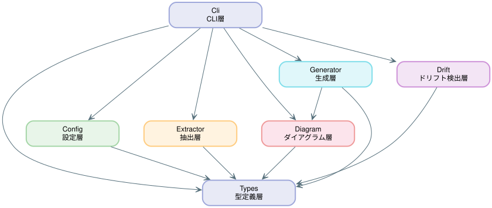
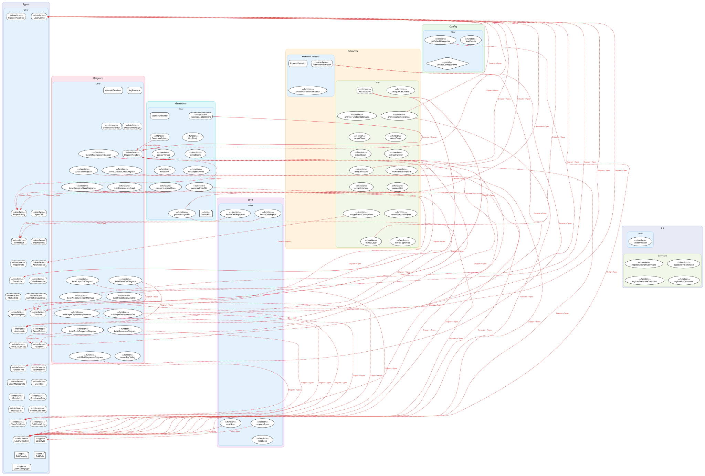

# システムアーキテクチャ概要

## プロジェクト

| 項目 | 詳細 |
| --- | --- |
| **名前** | archdoc |
| **説明** | DDD layered architecture documentation generator |
| **ソースルート** | `src/` |

## レイヤー

### レイヤー一覧

| レイヤー | パス | 責務 | 禁止インポート | 詳細 |
| --- | --- | --- | --- | --- |
| **Types** (型定義層) | `src/types/` | 共通型定義の提供 | `src/cli`, `src/config`, `src/diagram`, `src/drift`, `src/extractor`, `src/generator` | [types.md](./types.md) |
| **Config** (設定層) | `src/config/` | 設定ファイルの解析・バリデーション | `src/cli`, `src/diagram`, `src/drift`, `src/extractor`, `src/generator` | [config.md](./config.md) |
| **Extractor** (抽出層) | `src/extractor/` | ソースコードの静的解析と情報抽出 | `src/cli`, `src/diagram`, `src/generator` | [extractor.md](./extractor.md) |
| **Diagram** (ダイアグラム層) | `src/diagram/` | ダイアグラム生成 | `src/cli`, `src/config`, `src/extractor` | [diagram.md](./diagram.md) |
| **Generator** (生成層) | `src/generator/` | Markdownドキュメント生成 | `src/cli`, `src/config`, `src/extractor` | [generator.md](./generator.md) |
| **Drift** (ドリフト検出層) | `src/drift/` | 設定と実態の乖離検出 | `src/cli`, `src/diagram`, `src/generator` | [drift.md](./drift.md) |
| **Cli** (CLI層) | `src/cli/` | CLIインターフェースの提供 | — | [cli.md](./cli.md) |

### レイヤー依存関係

### 非標準レイヤー警告

以下のレイヤーはDDD標準4層（Domain / Application / Infrastructure / Presentation）に属しません。責務の重複・散在に注意してください。

| レイヤー | パス | 責務 |
| --- | --- | --- |
| **Types** (型定義層) | `src/types/` | 共通型定義の提供 |
| **Config** (設定層) | `src/config/` | 設定ファイルの解析・バリデーション |
| **Extractor** (抽出層) | `src/extractor/` | ソースコードの静的解析と情報抽出 |
| **Diagram** (ダイアグラム層) | `src/diagram/` | ダイアグラム生成 |
| **Generator** (生成層) | `src/generator/` | Markdownドキュメント生成 |
| **Drift** (ドリフト検出層) | `src/drift/` | 設定と実態の乖離検出 |
| **Cli** (CLI層) | `src/cli/` | CLIインターフェースの提供 |

## コンポーネント

### 凡例

**種別** — オブジェクト種別の表示アイコン

| アイコン | 説明 |
| --- | --- |
| 🏗️ class | クラス宣言 |
| 📋 interface | インターフェース宣言 |
| 🔧 function | エクスポート関数 |
| 📝 type | 型エイリアス |
| 🔢 enum | 列挙型宣言 |
| 📌 const | エクスポート定数 |

**カテゴリ** — ドメインカテゴリの表示アイコン（コンポーネント名に適用）

| アイコン | カテゴリ |
| --- | --- |
| 📦 | エンティティ / 集約 |
| 💎 | 値オブジェクト |
| 🗄️ | リポジトリ |
| ⚙️ | ユースケース |
| 🛠️ | ドメインサービス / サービス |
| 🌐 | ルーター / コントローラー |
| 📋 | DTO / 依存性注入 |
| 🛡️ | ミドルウェア / 認証 / バリデーション |
| ❌ | エラー |
| 🔌 | ポート |
| 🔗 | 外部サービス |

### Types (型定義層)

| コンポーネント | 種別 | カテゴリ | 説明 |
| --- | --- | --- | --- |
| `CategoryOverride` | 📋 interface | Other | パターンベースのカテゴリ上書き設定。 |
| `LayerConfig` | 📋 interface | Other | 単一アーキテクチャレイヤーの設定。 |
| `ProjectConfig` | 📋 interface | Other | layers.yamlから読み込まれるプロジェクト設定。 |
| `SpecDiff` | 📋 interface | Other | 2つの仕様スナップショット間で検出された単一の差分。 |
| `DriftResult` | 📋 interface | Other | レイヤーのドリフト検出結果。 |
| `DddWarning` | 📋 interface | Other | DDD設計原則に反する構造を検出した警告。 |
| `PropertyInfo` | 📋 interface | Other | クラスまたはインターフェースから抽出されたプロパティ情報。 |
| `ParameterInfo` | 📋 interface | Other | 関数またはメソッドから抽出された引数情報。 |
| `ThrowInfo` | 📋 interface | Other | JSDoc |
| `CallerReference` | 📋 interface | Other | このメソッドまたは関数を呼び出しているコンポーネントの参照情報。 |
| `MethodInfo` | 📋 interface | Other | シグネチャ・引数・ビジネスルールを含むメソッド情報。 |
| `MethodSignatureInfo` | 📋 interface | Other | インターフェース宣言から抽出されたメソッドシグネチャ。 |
| `DependencyInfo` | 📋 interface | Other | レイヤー間のインポート依存関係（禁止インポート検出含む）。 |
| `ClassInfo` | 📋 interface | Other | プロパティ・メソッド・依存関係を含むクラス情報。 |
| `InterfaceInfo` | 📋 interface | Other | プロパティ・メソッドシグネチャを含むインターフェース情報。 |
| `RouteCallInfo` | 📋 interface | Other | Expressルートハンドラ内のメソッド呼び出し。 |
| `RouteJSDocTag` | 📋 interface | Other | Expressルートハンドラから抽出されたJSDocタグ。 |
| `RouteInfo` | 📋 interface | Other | ミドルウェアとコールチェーンを含むExpressルート定義。 |
| `FunctionInfo` | 📋 interface | Other | シグネチャ・引数・ルート情報を含む関数情報。 |
| `TypeAliasInfo` | 📋 interface | Other | 型エイリアスの抽出情報。 |
| `EnumMemberInfo` | 📋 interface | Other | enum宣言の個別メンバー情報。 |
| `EnumInfo` | 📋 interface | Other | enum宣言の抽出情報。 |
| `ConstInfo` | 📋 interface | Other | エクスポートされた定数の抽出情報。 |
| `ConstructorDep` | 📋 interface | Other | コールチェーン解析用のコンストラクタ依存パラメータ。 |
| `MethodCall` | 📋 interface | Other | クラスメソッドまたは関数内での依存先への単一メソッド呼び出し。 |
| `MethodCallChain` | 📋 interface | Other | 単一メソッド内のすべての依存先呼び出し。 |
| `ClassCallChain` | 📋 interface | Other | クラスまたは関数の完全なコールチェーン（依存先とメソッド呼び出しを含む）。 |
| `CallChainEntry` | 📋 interface | Other | LayerExtractionに格納されるシリアライズ可能なコールチェーンエントリ。 |
| `LayerExtraction` | 📋 interface | Other | 単一アーキテクチャレイヤーの完全な抽出結果。 |
| `LayerType` | 📝 type | Other | DDDアーキテクチャで使用するレイヤー種別。 |
| `DriftSeverity` | 📝 type | Other | 仕様ドリフト検出の重大度レベル。 |
| `DddRole` | 📝 type | Other | DDDにおけるドメインモデルの役割分類。 |
| `DddWarningType` | 📝 type | Other | DDD構造警告の種別。 |

### Config (設定層)

| コンポーネント | 種別 | カテゴリ | 説明 |
| --- | --- | --- | --- |
| `getDefaultCategories` | 🔧 function | Other | 指定されたレイヤー種別に対応するデフォルトカテゴリマッピングを返す。 |
| `loadConfig` | 🔧 function | Other | layers.yamlファイルからプロジェクト設定を読み込みバリデーションする。 |
| `projectConfigSchema` | 📌 const | Other | layers.yamlプロジェクト設定のバリデーション用Zodスキーマ。 |

### Extractor (抽出層)

#### Framework

| コンポーネント | 種別 | カテゴリ | 説明 |
| --- | --- | --- | --- |
| `ExpressExtractor` | 🏗️ class | Framework Extractor | FrameworkExtractorを実装するExpress.jsルート抽出器。 |
| `NextjsExtractor` | 🏗️ class | Framework Extractor | Next.js App Router route handler extractor. |
| `FrameworkExtractor` | 📋 interface | Framework Extractor | フレームワーク固有のルート抽出用ストラテジーインターフェース。 |
| `NextjsComponentInfo` | 📋 interface | Framework Extractor | Metadata for a Next.js component file. |
| `createFrameworkExtractor` | 🔧 function | Framework Extractor | レイヤー設定に基づいてFrameworkExtractorを生成するファクトリ関数。 |
| `classifyNextjsComponent` | 🔧 function | Framework Extractor | Extract page and layout metadata from a Next.js App Router … |
| `extractServerActions` | 🔧 function | Framework Extractor | Extract Server Action functions from a file with "use serve… |

| コンポーネント | 種別 | カテゴリ | 説明 |
| --- | --- | --- | --- |
| `ParsedJsDoc` | 📋 interface | Other | 説明文・引数・throws・ビジネスルールを含むJSDoc解析結果。 |
| `analyzeCallChains` | 🔧 function | Other | エクスポートされた全クラスのコンストラクタインジェクションによるコールチェーンを解析する。 |
| `analyzeFunctionCallChains` | 🔧 function | Other | エクスポートされた全関数の引数ベースのコールチェーンを解析する。 |
| `analyzeCallerReferences` | 🔧 function | Other | Post-process: analyze caller references for all methods and… |
| `extractClass` | 🔧 function | Other | ts-morph ASTを使用してTypeScriptクラス宣言からメタデータを抽出する。 |
| `extractConst` | 🔧 function | Other | エクスポートされた定数宣言からメタデータを抽出する。 |
| `extractEnum` | 🔧 function | Other | TypeScript enum宣言からメタデータを抽出する。 |
| `extractFunction` | 🔧 function | Other | TypeScript関数宣言からメタデータを抽出する。 |
| `analyzeImports` | 🔧 function | Other | ソースファイルの全インポート文を解析し、対象レイヤーを特定する。 |
| `findForbiddenImports` | 🔧 function | Other | レイヤー設定に基づいて禁止されたクロスレイヤーインポートを検出する。 |
| `extractInterface` | 🔧 function | Other | TypeScriptインターフェース宣言からメタデータを抽出する。 |
| `parseJsDoc` | 🔧 function | Other | ts-morphノードからJSDocコメントを構造化データに変換する。 |
| `mergeParamDescriptions` | 🔧 function | Other | JSDoc |
| `createExtractorProject` | 🔧 function | Other | ソースコード解析用のts-morph Projectインスタンスを作成する。 |
| `extractLayer` | 🔧 function | Other | 単一アーキテクチャレイヤーから全コンポーネントを抽出する。 |
| `extractTypeAlias` | 🔧 function | Other | TypeScript型エイリアス宣言からメタデータを抽出する。 |

### Diagram (ダイアグラム層)

| コンポーネント | 種別 | カテゴリ | 説明 |
| --- | --- | --- | --- |
| `MermaidRenderer` | 🏗️ class | Other | DiagramRendererのMermaid実装。 |
| `SvgRenderer` | 🏗️ class | Other | DiagramRendererのSVG実装。 |
| `DependencyGraph` | 📋 interface | Other | レイヤー間依存関係を表すグラフ構造。 |
| `DependencyEdge` | 📋 interface | Other | 依存関係グラフの単一有向辺。 |
| `DiagramRenderer` | 📋 interface | Other | ダイアグラムレンダリングのストラテジーインターフェース。 |
| `buildC4ComponentDiagram` | 🔧 function | Other | プロジェクト設定からMermaid構文のC4コンポーネント図を生成する。 |
| `buildClassDiagram` | 🔧 function | Other | メンバー情報を含む詳細なMermaidクラス図を生成する。 |
| `buildCompactClassDiagram` | 🔧 function | Other | レイヤー全体のコンパクトな概要クラス図を生成する。 |
| `buildCategoryClassDiagrams` | 🔧 function | Other | カテゴリ別に分割したクラス図を生成する。 |
| `buildDependencyGraph` | 🔧 function | Other | レイヤー抽出結果と設定から依存関係グラフを構築する。 |
| `buildLayerDotDiagram` | 🔧 function | Other | レイヤー全体のコンパクトな概要DOTダイアグラムを生成する。 |
| `buildDetailDotDiagram` | 🔧 function | Other | クラス/インターフェースグループの完全なメンバー詳細を含むDOTダイアグラムを生成する。 |
| `buildProjectOverviewMermaid` | 🔧 function | Other | 全レイヤーにわたる全オブジェクトを表示するMermaidクラス図を生成する。 |
| `buildProjectOverviewDot` | 🔧 function | Other | 全レイヤーにわたる全オブジェクトを表示するDOTダイアグラムを生成する。 |
| `buildLayerDependencyMermaid` | 🔧 function | Other | エントリーポイントからの依存フローを示すシンプルなMermaidフローチャートを生成する。 |
| `buildLayerDependencyDot` | 🔧 function | Other | エントリーポイントからの依存フローを示すシンプルなDOTダイアグラムを生成する。 |
| `buildRouteSequenceDiagram` | 🔧 function | Other | 単一ルートハンドラーのコールチェーンからMermaidシーケンス図を生成する。 |
| `buildSequenceDiagram` | 🔧 function | Other | 単一コールチェーンエントリからMermaidシーケンス図を生成する。 |
| `buildMultiSequenceDiagrams` | 🔧 function | Other | 複数コールチェーンからクラス名をキーとするシーケンス図を生成する。 |
| `renderDotToSvg` | 🔧 function | Other | DOTグラフ文字列をviz.jsでSVGにレンダリングする。 |

### Generator (生成層)

| コンポーネント | 種別 | カテゴリ | 説明 |
| --- | --- | --- | --- |
| `MarkdownBuilder` | 🏗️ class | Other | Markdownドキュメントをプログラマティックに構築するFluentビルダー。 |
| `FeaturesGenerateOptions` | 📋 interface | Other | Options for features generation. |
| `IndexGenerateOptions` | 📋 interface | Other | ダイアグラムレンダラーを含むindex.md生成オプション。 |
| `GenerateOptions` | 📋 interface | Other | ダイアグラムレンダラーを含むレイヤードキュメント生成オプション。 |
| `generateCycleSection` | 🔧 function | Other | Generate a Markdown section for layer circular dependency w… |
| `kindEmoji` | 🔧 function | Other | オブジェクト種別に対応する絵文字アイコンを返す。 |
| `categoryEmoji` | 🔧 function | Other | ドメインカテゴリに対応する絵文字アイコンを返す。 |
| `formatName` | 🔧 function | Other | カテゴリ絵文字プレフィックス付きのコンポーネント名を整形する。 |
| `kindLabel` | 🔧 function | Other | 絵文字と種別名を組み合わせた表示ラベルを返す。 |
| `kindLegendRows` | 🔧 function | Other | 全オブジェクト種別アイコンの凡例テーブル行を生成する。 |
| `categoryLegendRows` | 🔧 function | Other | 全カテゴリアイコンの凡例テーブル行を生成する。 |
| `generateFeaturesMd` | 🔧 function | Other | Generate a feature list Markdown from extracted layer data. |
| `generateIndexMd` | 🔧 function | Other | プロジェクト全体の概要ドキュメントindex.mdを生成する。 |
| `generateLayerMd` | 🔧 function | Other | 単一アーキテクチャレイヤーのMarkdownドキュメントを生成する。 |
| `generateResponsibilitySection` | 🔧 function | Other | Generate a Markdown section for Next.js responsibility sepa… |
| `ObjectKind` | 📝 type | Other | ドキュメント出力で使用するオブジェクト種別。 |

### Drift (ドリフト検出層)

| コンポーネント | 種別 | カテゴリ | 説明 |
| --- | --- | --- | --- |
| `formatDriftReport` | 🔧 function | Other | ドリフト検出結果を人間が読みやすいテキストレポートに整形する。 |
| `formatDriftReportMd` | 🔧 function | Other | ドリフト検出結果をMarkdownレポートに整形する。 |
| `compareSpecs` | 🔧 function | Other | 2つのレイヤー抽出スナップショットを比較し、仕様ドリフトを検出する。 |
| `saveSpec` | 🔧 function | Other | レイヤー抽出スナップショットをJSONファイルに保存する。 |
| `loadSpec` | 🔧 function | Other | 保存済みのレイヤー抽出スナップショットをJSONファイルから読み込む。 |

### Cli (CLI層)

| コンポーネント | 種別 | カテゴリ | 説明 |
| --- | --- | --- | --- |
| `createProgram` | 🔧 function | Other | 全CLIサブコマンドを登録したCommander.jsプログラムを作成する。 |

#### Commands

| コンポーネント | 種別 | カテゴリ | 説明 |
| --- | --- | --- | --- |
| `registerDiagramCommand` | 🔧 function | Command | 単体ダイアグラム生成用の'diagram'サブコマンドを登録する。 |
| `registerDriftCommand` | 🔧 function | Command | 仕様ドリフト検出用の'drift'サブコマンドを登録する。 |
| `registerFeaturesCommand` | 🔧 function | Command | Register the 'features' subcommand for feature list generat… |
| `registerGenerateCommand` | 🔧 function | Command | ドキュメント生成用の'generate'サブコマンドを登録する。 |
| `registerInitCommand` | 🔧 function | Command | layers.yaml初期化用の'init'サブコマンドを登録する。 |
