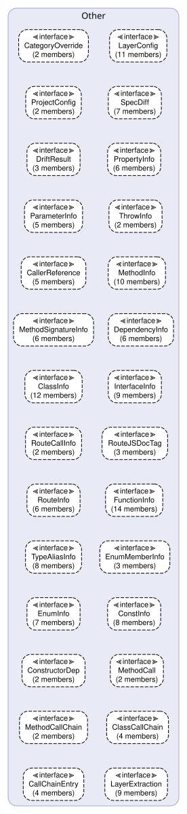
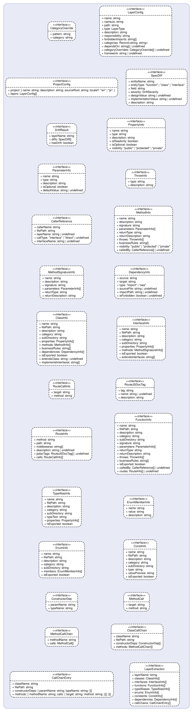

# Types — 型定義層 API Spec

## Responsibilities & Constraints

| Item | Detail |
| --- | --- |
| **Path** | `src/types/` |
| **Responsibility** | 共通型定義の提供 |
| **Forbidden Imports** | `src/cli`, `src/config`, `src/diagram`, `src/drift`, `src/extractor`, `src/generator` |

プロジェクト全体で共有される型定義。
設定ファイル構造と抽出結果の型を定義。



## Other



### 📋 `CategoryOverride`

> **File**: `config.ts`
> **Type**: Other

**Properties**

| Property | Type | Required | Description |
| --- | --- | --- | --- |
| `pattern` | `string` | ✓ | — |
| `category` | `string` | ✓ | — |

### 📋 `LayerConfig`

> **File**: `config.ts`
> **Type**: Other

**Properties**

| Property | Type | Required | Description |
| --- | --- | --- | --- |
| `name` | `string` | ✓ | — |
| `nameJa` | `string` | ✓ | — |
| `path` | `string` | ✓ | — |
| `type` | `LayerType` | ✓ | — |
| `description` | `string` | ✓ | — |
| `responsibility` | `string` | ✓ | — |
| `forbiddenImports` | `string[]` | ✓ | — |
| `categories` | `Record<string, string>` | ✓ | — |
| `dependsOn` | `string[] or undefined` | — | Allowed dependency targets (layer names). If omitted, inferred from type. |
| `categoryOverrides` | `CategoryOverride[] or undefined` | — | Name-pattern-based category overrides applied after directory-based resolution |
| `framework` | `string or undefined` | — | Framework identifier for framework-specific extraction (e.g. "express") |

### 📋 `ProjectConfig`

> **File**: `config.ts`
> **Type**: Other

**Properties**

| Property | Type | Required | Description |
| --- | --- | --- | --- |
| `project` | `{ name: string; description: string; sourceRoot: string; }` | ✓ | — |
| `layers` | `LayerConfig[]` | ✓ | — |

### 📋 `SpecDiff`

> **File**: `drift.ts`
> **Type**: Other

**Properties**

| Property | Type | Required | Description |
| --- | --- | --- | --- |
| `entityName` | `string` | ✓ | — |
| `entityType` | `"function" or "class" or "interface"` | ✓ | — |
| `field` | `string` | ✓ | — |
| `severity` | `DriftSeverity` | ✓ | — |
| `designValue` | `string or undefined` | — | — |
| `implementationValue` | `string or undefined` | — | — |
| `description` | `string` | ✓ | — |

### 📋 `DriftResult`

> **File**: `drift.ts`
> **Type**: Other

**Properties**

| Property | Type | Required | Description |
| --- | --- | --- | --- |
| `layerName` | `string` | ✓ | — |
| `diffs` | `SpecDiff[]` | ✓ | — |
| `hasDrift` | `boolean` | ✓ | — |

### 📋 `PropertyInfo`

> **File**: `extracted.ts`
> **Type**: Other

**Properties**

| Property | Type | Required | Description |
| --- | --- | --- | --- |
| `name` | `string` | ✓ | — |
| `type` | `string` | ✓ | — |
| `description` | `string` | ✓ | — |
| `isReadonly` | `boolean` | ✓ | — |
| `isOptional` | `boolean` | ✓ | — |
| `visibility` | `"public" or "protected" or "private"` | ✓ | — |

### 📋 `ParameterInfo`

> **File**: `extracted.ts`
> **Type**: Other

**Properties**

| Property | Type | Required | Description |
| --- | --- | --- | --- |
| `name` | `string` | ✓ | — |
| `type` | `string` | ✓ | — |
| `description` | `string` | ✓ | — |
| `isOptional` | `boolean` | ✓ | — |
| `defaultValue` | `string or undefined` | — | — |

### 📋 `ThrowInfo`

> **File**: `extracted.ts`
> **Type**: Other

**Properties**

| Property | Type | Required | Description |
| --- | --- | --- | --- |
| `type` | `string` | ✓ | — |
| `description` | `string` | ✓ | — |

### 📋 `CallerReference`

> **File**: `extracted.ts`
> **Type**: Other

**Properties**

| Property | Type | Required | Description |
| --- | --- | --- | --- |
| `callerName` | `string` | ✓ | — |
| `filePath` | `string` | ✓ | — |
| `layerName` | `string or undefined` | — | — |
| `callType` | `"interface" or "direct" or undefined` | — | — |
| `interfaceName` | `string or undefined` | — | — |

### 📋 `MethodInfo`

> **File**: `extracted.ts`
> **Type**: Other

**Properties**

| Property | Type | Required | Description |
| --- | --- | --- | --- |
| `name` | `string` | ✓ | — |
| `description` | `string` | ✓ | — |
| `signature` | `string` | ✓ | — |
| `parameters` | `ParameterInfo[]` | ✓ | — |
| `returnType` | `string` | ✓ | — |
| `returnDescription` | `string` | ✓ | — |
| `throws` | `ThrowInfo[]` | ✓ | — |
| `businessRules` | `string[]` | ✓ | — |
| `visibility` | `"public" or "protected" or "private"` | ✓ | — |
| `calledBy` | `CallerReference[] or undefined` | — | — |

### 📋 `MethodSignatureInfo`

> **File**: `extracted.ts`
> **Type**: Other

**Properties**

| Property | Type | Required | Description |
| --- | --- | --- | --- |
| `name` | `string` | ✓ | — |
| `description` | `string` | ✓ | — |
| `signature` | `string` | ✓ | — |
| `parameters` | `ParameterInfo[]` | ✓ | — |
| `returnType` | `string` | ✓ | — |
| `returnDescription` | `string` | ✓ | — |

### 📋 `DependencyInfo`

> **File**: `extracted.ts`
> **Type**: Other

**Properties**

| Property | Type | Required | Description |
| --- | --- | --- | --- |
| `source` | `string` | ✓ | — |
| `target` | `string` | ✓ | — |
| `type` | `"import" or "see"` | ✓ | — |
| `sourceFile` | `string or undefined` | — | — |
| `importPath` | `string or undefined` | — | — |
| `isForbidden` | `boolean or undefined` | — | — |

### 📋 `ClassInfo`

> **File**: `extracted.ts`
> **Type**: Other

**Properties**

| Property | Type | Required | Description |
| --- | --- | --- | --- |
| `name` | `string` | ✓ | — |
| `filePath` | `string` | ✓ | — |
| `description` | `string` | ✓ | — |
| `category` | `string` | ✓ | — |
| `subDirectory` | `string` | ✓ | — |
| `properties` | `PropertyInfo[]` | ✓ | — |
| `methods` | `MethodInfo[]` | ✓ | — |
| `businessRules` | `string[]` | ✓ | — |
| `dependencies` | `DependencyInfo[]` | ✓ | — |
| `isExported` | `boolean` | ✓ | — |
| `extendsClass` | `string or undefined` | — | — |
| `implementsInterfaces` | `string[]` | ✓ | — |

### 📋 `InterfaceInfo`

> **File**: `extracted.ts`
> **Type**: Other

**Properties**

| Property | Type | Required | Description |
| --- | --- | --- | --- |
| `name` | `string` | ✓ | — |
| `filePath` | `string` | ✓ | — |
| `description` | `string` | ✓ | — |
| `category` | `string` | ✓ | — |
| `subDirectory` | `string` | ✓ | — |
| `properties` | `PropertyInfo[]` | ✓ | — |
| `methods` | `MethodSignatureInfo[]` | ✓ | — |
| `isExported` | `boolean` | ✓ | — |
| `extendsInterfaces` | `string[]` | ✓ | — |

### 📋 `RouteCallInfo`

> **File**: `extracted.ts`
> **Type**: Other

**Properties**

| Property | Type | Required | Description |
| --- | --- | --- | --- |
| `target` | `string` | ✓ | — |
| `method` | `string` | ✓ | — |

### 📋 `RouteJSDocTag`

> **File**: `extracted.ts`
> **Type**: Other

**Properties**

| Property | Type | Required | Description |
| --- | --- | --- | --- |
| `tag` | `string` | ✓ | — |
| `name` | `string or undefined` | — | — |
| `description` | `string` | ✓ | — |

### 📋 `RouteInfo`

> **File**: `extracted.ts`
> **Type**: Other

**Properties**

| Property | Type | Required | Description |
| --- | --- | --- | --- |
| `method` | `string` | ✓ | — |
| `path` | `string` | ✓ | — |
| `middlewares` | `string[]` | ✓ | — |
| `description` | `string or undefined` | — | — |
| `jsdocTags` | `RouteJSDocTag[] or undefined` | — | — |
| `calls` | `RouteCallInfo[]` | ✓ | — |

### 📋 `FunctionInfo`

> **File**: `extracted.ts`
> **Type**: Other

**Properties**

| Property | Type | Required | Description |
| --- | --- | --- | --- |
| `name` | `string` | ✓ | — |
| `filePath` | `string` | ✓ | — |
| `description` | `string` | ✓ | — |
| `category` | `string` | ✓ | — |
| `subDirectory` | `string` | ✓ | — |
| `signature` | `string` | ✓ | — |
| `parameters` | `ParameterInfo[]` | ✓ | — |
| `returnType` | `string` | ✓ | — |
| `returnDescription` | `string` | ✓ | — |
| `throws` | `ThrowInfo[]` | ✓ | — |
| `businessRules` | `string[]` | ✓ | — |
| `isExported` | `boolean` | ✓ | — |
| `calledBy` | `CallerReference[] or undefined` | — | — |
| `routes` | `RouteInfo[] or undefined` | — | — |

### 📋 `TypeAliasInfo`

> **File**: `extracted.ts`
> **Type**: Other

**Properties**

| Property | Type | Required | Description |
| --- | --- | --- | --- |
| `name` | `string` | ✓ | — |
| `filePath` | `string` | ✓ | — |
| `description` | `string` | ✓ | — |
| `category` | `string` | ✓ | — |
| `subDirectory` | `string` | ✓ | — |
| `typeText` | `string` | ✓ | — |
| `properties` | `PropertyInfo[]` | ✓ | — |
| `isExported` | `boolean` | ✓ | — |

### 📋 `EnumMemberInfo`

> **File**: `extracted.ts`
> **Type**: Other

**Properties**

| Property | Type | Required | Description |
| --- | --- | --- | --- |
| `name` | `string` | ✓ | — |
| `value` | `string` | ✓ | — |
| `description` | `string` | ✓ | — |

### 📋 `EnumInfo`

> **File**: `extracted.ts`
> **Type**: Other

**Properties**

| Property | Type | Required | Description |
| --- | --- | --- | --- |
| `name` | `string` | ✓ | — |
| `filePath` | `string` | ✓ | — |
| `description` | `string` | ✓ | — |
| `category` | `string` | ✓ | — |
| `subDirectory` | `string` | ✓ | — |
| `members` | `EnumMemberInfo[]` | ✓ | — |
| `isExported` | `boolean` | ✓ | — |

### 📋 `ConstInfo`

> **File**: `extracted.ts`
> **Type**: Other

**Properties**

| Property | Type | Required | Description |
| --- | --- | --- | --- |
| `name` | `string` | ✓ | — |
| `filePath` | `string` | ✓ | — |
| `description` | `string` | ✓ | — |
| `category` | `string` | ✓ | — |
| `subDirectory` | `string` | ✓ | — |
| `type` | `string` | ✓ | — |
| `valuePreview` | `string` | ✓ | — |
| `isExported` | `boolean` | ✓ | — |

### 📋 `ConstructorDep`

> **File**: `extracted.ts`
> **Type**: Other

**Properties**

| Property | Type | Required | Description |
| --- | --- | --- | --- |
| `paramName` | `string` | ✓ | — |
| `typeName` | `string` | ✓ | — |

### 📋 `MethodCall`

> **File**: `extracted.ts`
> **Type**: Other

**Properties**

| Property | Type | Required | Description |
| --- | --- | --- | --- |
| `target` | `string` | ✓ | — |
| `method` | `string` | ✓ | — |

### 📋 `MethodCallChain`

> **File**: `extracted.ts`
> **Type**: Other

**Properties**

| Property | Type | Required | Description |
| --- | --- | --- | --- |
| `methodName` | `string` | ✓ | — |
| `calls` | `MethodCall[]` | ✓ | — |

### 📋 `ClassCallChain`

> **File**: `extracted.ts`
> **Type**: Other

**Properties**

| Property | Type | Required | Description |
| --- | --- | --- | --- |
| `className` | `string` | ✓ | — |
| `filePath` | `string` | ✓ | — |
| `constructorDeps` | `ConstructorDep[]` | ✓ | — |
| `methods` | `MethodCallChain[]` | ✓ | — |

### 📋 `CallChainEntry`

> **File**: `extracted.ts`
> **Type**: Other

**Properties**

| Property | Type | Required | Description |
| --- | --- | --- | --- |
| `className` | `string` | ✓ | — |
| `filePath` | `string` | ✓ | — |
| `constructorDeps` | `{ paramName: string; typeName: string; }[]` | ✓ | — |
| `methods` | `{ methodName: string; calls: { target: string; method: string; }[]; }[]` | ✓ | — |

### 📋 `LayerExtraction`

> **File**: `extracted.ts`
> **Type**: Other

**Properties**

| Property | Type | Required | Description |
| --- | --- | --- | --- |
| `layerName` | `string` | ✓ | — |
| `classes` | `ClassInfo[]` | ✓ | — |
| `interfaces` | `InterfaceInfo[]` | ✓ | — |
| `functions` | `FunctionInfo[]` | ✓ | — |
| `typeAliases` | `TypeAliasInfo[]` | ✓ | — |
| `enums` | `EnumInfo[]` | ✓ | — |
| `constants` | `ConstInfo[]` | ✓ | — |
| `dependencies` | `DependencyInfo[]` | ✓ | — |
| `callChains` | `CallChainEntry[]` | ✓ | — |

### 📝 `LayerType`

> **File**: `config.ts`
> **Type**: Other

```typescript
"domain" | "application" | "presentation" | "infrastructure" | "custom"
```

### 📝 `DriftSeverity`

> **File**: `drift.ts`
> **Type**: Other

```typescript
"added" | "removed" | "changed"
```
