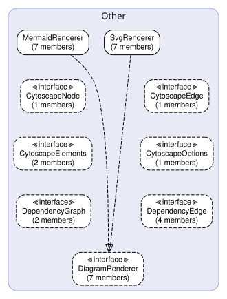

# Diagram — ダイアグラム層 API仕様

## 責務と制約

| 項目 | 詳細 |
| --- | --- |
| **パス** | `src/diagram/` |
| **責務** | ダイアグラム生成 |
| **禁止インポート** | `src/cli`, `src/config`, `src/extractor` |

Mermaid/DOT形式のアーキテクチャ図を生成。
レイヤー間依存関係・オブジェクト関連図のレンダリング。



## Diagramのコンポーネント


### 🏗️ `MermaidRenderer` クラス

> **ファイル**: `mermaid-renderer.ts`
> **型**: Other

DiagramRendererのMermaid実装。
Markdownに埋め込み可能なMermaidコードブロックを返す。

**メソッド**

#### `renderLayerOverview` メソッド

```ts
renderLayerOverview(extraction: LayerExtraction): Promise<string | null>
```

| 引数 | 型 | 説明 |
| --- | --- | --- |
| `extraction` | `LayerExtraction` | — |

**戻り値**: `Promise<string or null>` 

**呼び出し元**

- `generateLayerMd()` — Generator (`layer-generator.ts`) via `DiagramRenderer`

#### `renderDetailClassDiagram` メソッド

```ts
renderDetailClassDiagram(classes: ClassInfo[], interfaces: InterfaceInfo[]): Promise<string | null>
```

| 引数 | 型 | 説明 |
| --- | --- | --- |
| `classes` | `ClassInfo[]` | — |
| `interfaces` | `InterfaceInfo[]` | — |

**戻り値**: `Promise<string or null>` 

**呼び出し元**

- `renderGroupDiagramAndItems()` — Generator (`layer-generator.ts`) via `DiagramRenderer`

#### `renderSequenceDiagram` メソッド

```ts
renderSequenceDiagram(chain: ClassCallChain): Promise<string | null>
```

| 引数 | 型 | 説明 |
| --- | --- | --- |
| `chain` | `ClassCallChain` | — |

**戻り値**: `Promise<string or null>` 

**呼び出し元**

- `renderMethodSequenceDiagram()` — Generator (`layer-generator.ts`) via `DiagramRenderer`
- `renderFunctionSequenceDiagram()` — Generator (`layer-generator.ts`) via `DiagramRenderer`

#### `renderRouteSequenceDiagram` メソッド

```ts
renderRouteSequenceDiagram(funcName: string, route: RouteInfo): Promise<string | null>
```

| 引数 | 型 | 説明 |
| --- | --- | --- |
| `funcName` | `string` | — |
| `route` | `RouteInfo` | — |

**戻り値**: `Promise<string or null>` 

**呼び出し元**

- `renderFunction()` — Generator (`layer-generator.ts`) via `DiagramRenderer`

#### `renderProjectOverview` メソッド

```ts
renderProjectOverview(extractions: LayerExtraction[], layers?: LayerConfig[] | undefined): Promise<string | null>
```

| 引数 | 型 | 説明 |
| --- | --- | --- |
| `extractions` | `LayerExtraction[]` | — |
| `layers` | `LayerConfig[] or undefined` | — |

**戻り値**: `Promise<string or null>` 

**呼び出し元**

- `generateIndexMd()` — Generator (`index-generator.ts`) via `DiagramRenderer`

#### `renderLayerDependency` メソッド

```ts
renderLayerDependency(extractions: LayerExtraction[], layers?: LayerConfig[] | undefined): Promise<string | null>
```

| 引数 | 型 | 説明 |
| --- | --- | --- |
| `extractions` | `LayerExtraction[]` | — |
| `layers` | `LayerConfig[] or undefined` | — |

**戻り値**: `Promise<string or null>` 

**呼び出し元**

- `generateIndexMd()` — Generator (`index-generator.ts`) via `DiagramRenderer`

#### `renderInteractiveOverview` メソッド

```ts
renderInteractiveOverview(config: ProjectConfig, extractions: LayerExtraction[]): Promise<string | null>
```

| 引数 | 型 | 説明 |
| --- | --- | --- |
| `config` | `ProjectConfig` | — |
| `extractions` | `LayerExtraction[]` | — |

**戻り値**: `Promise<string or null>` 

**呼び出し元**

- `generateIndexMd()` — Generator (`index-generator.ts`) via `DiagramRenderer`

### 🏗️ `SvgRenderer` クラス

> **ファイル**: `svg-renderer.ts`
> **型**: Other

DiagramRendererのSVG実装。
DOT → SVGファイルを生成し、Markdown画像参照文字列を返す。

**メソッド**

#### `renderLayerOverview` メソッド

```ts
renderLayerOverview(extraction: LayerExtraction): Promise<string | null>
```

| 引数 | 型 | 説明 |
| --- | --- | --- |
| `extraction` | `LayerExtraction` | — |

**戻り値**: `Promise<string or null>` 

**呼び出し元**

- `generateLayerMd()` — Generator (`layer-generator.ts`) via `DiagramRenderer`

#### `renderDetailClassDiagram` メソッド

```ts
renderDetailClassDiagram(classes: ClassInfo[], interfaces: InterfaceInfo[]): Promise<string | null>
```

| 引数 | 型 | 説明 |
| --- | --- | --- |
| `classes` | `ClassInfo[]` | — |
| `interfaces` | `InterfaceInfo[]` | — |

**戻り値**: `Promise<string or null>` 

**呼び出し元**

- `renderGroupDiagramAndItems()` — Generator (`layer-generator.ts`) via `DiagramRenderer`

#### `renderSequenceDiagram` メソッド

```ts
renderSequenceDiagram(chain: ClassCallChain): Promise<string | null>
```

| 引数 | 型 | 説明 |
| --- | --- | --- |
| `chain` | `ClassCallChain` | — |

**戻り値**: `Promise<string or null>` 

**呼び出し元**

- `renderMethodSequenceDiagram()` — Generator (`layer-generator.ts`) via `DiagramRenderer`
- `renderFunctionSequenceDiagram()` — Generator (`layer-generator.ts`) via `DiagramRenderer`

#### `renderRouteSequenceDiagram` メソッド

```ts
renderRouteSequenceDiagram(funcName: string, route: RouteInfo): Promise<string | null>
```

| 引数 | 型 | 説明 |
| --- | --- | --- |
| `funcName` | `string` | — |
| `route` | `RouteInfo` | — |

**戻り値**: `Promise<string or null>` 

**呼び出し元**

- `renderFunction()` — Generator (`layer-generator.ts`) via `DiagramRenderer`

#### `renderProjectOverview` メソッド

```ts
renderProjectOverview(extractions: LayerExtraction[], layers?: LayerConfig[] | undefined): Promise<string | null>
```

| 引数 | 型 | 説明 |
| --- | --- | --- |
| `extractions` | `LayerExtraction[]` | — |
| `layers` | `LayerConfig[] or undefined` | — |

**戻り値**: `Promise<string or null>` 

**呼び出し元**

- `generateIndexMd()` — Generator (`index-generator.ts`) via `DiagramRenderer`

#### `renderLayerDependency` メソッド

```ts
renderLayerDependency(extractions: LayerExtraction[], layers?: LayerConfig[] | undefined): Promise<string | null>
```

| 引数 | 型 | 説明 |
| --- | --- | --- |
| `extractions` | `LayerExtraction[]` | — |
| `layers` | `LayerConfig[] or undefined` | — |

**戻り値**: `Promise<string or null>` 

**呼び出し元**

- `generateIndexMd()` — Generator (`index-generator.ts`) via `DiagramRenderer`

#### `renderInteractiveOverview` メソッド

```ts
renderInteractiveOverview(config: ProjectConfig, extractions: LayerExtraction[]): Promise<string | null>
```

| 引数 | 型 | 説明 |
| --- | --- | --- |
| `config` | `ProjectConfig` | — |
| `extractions` | `LayerExtraction[]` | — |

**戻り値**: `Promise<string or null>` 

**呼び出し元**

- `generateIndexMd()` — Generator (`index-generator.ts`) via `DiagramRenderer`

### 📋 `CytoscapeNode` インターフェース

> **ファイル**: `cytoscape-data-builder.ts`
> **型**: Other

**プロパティ**

| プロパティ | 型 | 必須 | 説明 |
| --- | --- | --- | --- |
| `data` | `{ id: string; label: string; parent?: string; kind: string; category: string; layer: string; filePath: string; description: string; dddRole?: string; }` | ✓ | — |

### 📋 `CytoscapeEdge` インターフェース

> **ファイル**: `cytoscape-data-builder.ts`
> **型**: Other

**プロパティ**

| プロパティ | 型 | 必須 | 説明 |
| --- | --- | --- | --- |
| `data` | `{ id: string; source: string; target: string; type: string; isForbidden: boolean; count?: number; sourceFile?: string; importPath?: string; }` | ✓ | — |

### 📋 `CytoscapeElements` インターフェース

> **ファイル**: `cytoscape-data-builder.ts`
> **型**: Other

**プロパティ**

| プロパティ | 型 | 必須 | 説明 |
| --- | --- | --- | --- |
| `nodes` | `CytoscapeNode[]` | ✓ | — |
| `edges` | `CytoscapeEdge[]` | ✓ | — |

### 📋 `DependencyGraph` インターフェース

> **ファイル**: `dependency-graph.ts`
> **型**: Other

レイヤー間依存関係を表すグラフ構造。

**プロパティ**

| プロパティ | 型 | 必須 | 説明 |
| --- | --- | --- | --- |
| `nodes` | `string[]` | ✓ | — |
| `edges` | `DependencyEdge[]` | ✓ | — |

### 📋 `DependencyEdge` インターフェース

> **ファイル**: `dependency-graph.ts`
> **型**: Other

依存関係グラフの単一有向辺。

**プロパティ**

| プロパティ | 型 | 必須 | 説明 |
| --- | --- | --- | --- |
| `source` | `string` | ✓ | — |
| `target` | `string` | ✓ | — |
| `count` | `number` | ✓ | — |
| `isForbidden` | `boolean` | ✓ | — |

### 📋 `DiagramRenderer` インターフェース

> **ファイル**: `diagram-renderer.ts`
> **型**: Other

ダイアグラムレンダリングのストラテジーインターフェース。
実装クラス（MermaidRenderer、SvgRenderer）はフォーマット固有の
Markdownスニペットを生成し、ドキュメントに埋め込める形式で返す。

**メソッド**

#### `renderLayerOverview` メソッド

レイヤー全体のコンパクトな概要クラス図をレンダリングする。
クラス/インターフェース名と関係のみを表示し、メンバー詳細は含まない。

```ts
renderLayerOverview(extraction: LayerExtraction): Promise<string | null>
```

| 引数 | 型 | 説明 |
| --- | --- | --- |
| `extraction` | `LayerExtraction` | レイヤーの抽出結果 |

**戻り値**: `Promise<string or null>` Markdownスニペット文字列、またはnull

#### `renderDetailClassDiagram` メソッド

クラス/インターフェースグループの詳細クラス図をレンダリングする。
プロパティ・メソッドを含む完全なメンバー情報と関係を表示する。

```ts
renderDetailClassDiagram(classes: ClassInfo[], interfaces: InterfaceInfo[]): Promise<string | null>
```

| 引数 | 型 | 説明 |
| --- | --- | --- |
| `classes` | `ClassInfo[]` | クラス情報配列 |
| `interfaces` | `InterfaceInfo[]` | インターフェース情報配列 |

**戻り値**: `Promise<string or null>` Markdownスニペット文字列、またはnull

#### `renderSequenceDiagram` メソッド

クラスコールチェーンのシーケンス図をレンダリングする。

```ts
renderSequenceDiagram(chain: ClassCallChain): Promise<string | null>
```

| 引数 | 型 | 説明 |
| --- | --- | --- |
| `chain` | `ClassCallChain` | コールチェーンエントリ |

**戻り値**: `Promise<string or null>` Markdownスニペット文字列、またはnull

#### `renderRouteSequenceDiagram` メソッド

単一ルートハンドラーのコールチェーンからシーケンス図をレンダリングする。

```ts
renderRouteSequenceDiagram(funcName: string, route: RouteInfo): Promise<string | null>
```

| 引数 | 型 | 説明 |
| --- | --- | --- |
| `funcName` | `string` | 関数名 |
| `route` | `RouteInfo` | ルート情報 |

**戻り値**: `Promise<string or null>` Markdownスニペット文字列、またはnull

#### `renderProjectOverview` メソッド

レイヤー横断のプロジェクト概要ダイアグラムをレンダリングする。
レイヤー別にグループ化した全オブジェクトを表示し、依存違反のみ線を引く。

```ts
renderProjectOverview(extractions: LayerExtraction[], layers?: LayerConfig[] | undefined): Promise<string | null>
```

| 引数 | 型 | 説明 |
| --- | --- | --- |
| `extractions` | `LayerExtraction[]` | 全レイヤーの抽出結果 |
| `layers` | `LayerConfig[] or undefined` | レイヤー設定配列（省略可） |

**戻り値**: `Promise<string or null>` Markdownスニペット文字列、またはnull

#### `renderLayerDependency` メソッド

レイヤー間の依存関係をシンプルなフローチャートでレンダリングする。
各レイヤーをボックスで表示し、実際のインポート依存関係を矢印で描画する。

```ts
renderLayerDependency(extractions: LayerExtraction[], layers?: LayerConfig[] | undefined): Promise<string | null>
```

| 引数 | 型 | 説明 |
| --- | --- | --- |
| `extractions` | `LayerExtraction[]` | 全レイヤーの抽出結果 |
| `layers` | `LayerConfig[] or undefined` | レイヤー設定配列（省略可） |

**戻り値**: `Promise<string or null>` Markdownスニペット文字列、またはnull

#### `renderInteractiveOverview` メソッド

Cytoscape.jsインタラクティブ図のHTMLファイルを生成し、
iframe埋め込み用のMarkdownスニペットを返す。

```ts
renderInteractiveOverview(config: ProjectConfig, extractions: LayerExtraction[]): Promise<string | null>
```

| 引数 | 型 | 説明 |
| --- | --- | --- |
| `config` | `ProjectConfig` | プロジェクト設定 |
| `extractions` | `LayerExtraction[]` | 全レイヤーの抽出結果 |

**戻り値**: `Promise<string or null>` Markdownスニペット文字列、またはnull

### 🔧 `buildC4ComponentDiagram` 関数

> **ファイル**: `c4-builder.ts`

プロジェクト設定からMermaid構文のC4コンポーネント図を生成する。

```ts
buildC4ComponentDiagram(config: ProjectConfig, graph: DependencyGraph): string
```

| 引数 | 型 | 説明 |
| --- | --- | --- |
| `config` | `ProjectConfig` | プロジェクト設定 |
| `graph` | `DependencyGraph` | 依存関係グラフ |

**戻り値**: `string` Mermaid形式のC4図文字列

**呼び出し元**

- `registerDiagramCommand()` — Cli (`diagram.ts`)

### 🔧 `buildClassDiagram` 関数

> **ファイル**: `class-diagram-builder.ts`

メンバー情報を含む詳細なMermaidクラス図を生成する。

```ts
buildClassDiagram(extraction: LayerExtraction): string
```

| 引数 | 型 | 説明 |
| --- | --- | --- |
| `extraction` | `LayerExtraction` | レイヤーの抽出結果 |

**戻り値**: `string` Mermaidクラス図文字列

### 🔧 `buildCompactClassDiagram` 関数

> **ファイル**: `class-diagram-builder.ts`

レイヤー全体のコンパクトな概要クラス図を生成する。
クラス/インターフェース名と関係のみを表示し、メンバー詳細は含まない。

```ts
buildCompactClassDiagram(extraction: LayerExtraction): string
```

| 引数 | 型 | 説明 |
| --- | --- | --- |
| `extraction` | `LayerExtraction` | レイヤーの抽出結果 |

**戻り値**: `string` Mermaidクラス図文字列

**呼び出し元**

- `MermaidRenderer.renderLayerOverview()` — Diagram (`mermaid-renderer.ts`)

### 🔧 `buildCategoryClassDiagrams` 関数

> **ファイル**: `class-diagram-builder.ts`

カテゴリ別に分割したクラス図を生成する。

```ts
buildCategoryClassDiagrams(classes: ClassInfo[], interfaces: InterfaceInfo[]): string[]
```

| 引数 | 型 | 説明 |
| --- | --- | --- |
| `classes` | `ClassInfo[]` | クラス情報配列 |
| `interfaces` | `InterfaceInfo[]` | インターフェース情報配列 |

**戻り値**: `string[]` クラス図文字列の配列

**呼び出し元**

- `MermaidRenderer.renderDetailClassDiagram()` — Diagram (`mermaid-renderer.ts`)

### 🔧 `buildCytoscapeElements` 関数

> **ファイル**: `cytoscape-data-builder.ts`

Build Cytoscape.js elements JSON from archdoc extraction data.

```ts
buildCytoscapeElements(config: ProjectConfig, extractions: LayerExtraction[]): CytoscapeElements
```

| 引数 | 型 | 説明 |
| --- | --- | --- |
| `config` | `ProjectConfig` | Project configuration |
| `extractions` | `LayerExtraction[]` | All layer extraction results |

**戻り値**: `CytoscapeElements` Cytoscape.js compatible elements

**呼び出し元**

- `buildCytoscapeHtml()` — Diagram (`cytoscape-html-builder.ts`)

### 🔧 `buildCytoscapeHtml` 関数

> **ファイル**: `cytoscape-html-builder.ts`

Build a standalone HTML file with Cytoscape.js interactive component graph.
The HTML is self-contained (CDN dependencies only) and can be opened directly in a browser.

```ts
buildCytoscapeHtml(config: ProjectConfig, extractions: LayerExtraction[]): string
```

| 引数 | 型 | 説明 |
| --- | --- | --- |
| `config` | `ProjectConfig` | Project configuration |
| `extractions` | `LayerExtraction[]` | All layer extraction results |

**戻り値**: `string` Complete HTML string

**呼び出し元**

- `MermaidRenderer.renderInteractiveOverview()` — Diagram (`mermaid-renderer.ts`)
- `SvgRenderer.renderInteractiveOverview()` — Diagram (`svg-renderer.ts`)

### 🔧 `buildDependencyGraph` 関数

> **ファイル**: `dependency-graph.ts`

レイヤー抽出結果と設定から依存関係グラフを構築する。

```ts
buildDependencyGraph(config: ProjectConfig, extractions: LayerExtraction[]): DependencyGraph
```

| 引数 | 型 | 説明 |
| --- | --- | --- |
| `config` | `ProjectConfig` | プロジェクト設定 |
| `extractions` | `LayerExtraction[]` | 全レイヤーの抽出結果 |

**戻り値**: `DependencyGraph` 依存関係グラフ

**呼び出し元**

- `registerDiagramCommand()` — Cli (`diagram.ts`)

### 🔧 `buildLayerDotDiagram` 関数

> **ファイル**: `dot-class-builder.ts`

レイヤー全体のコンパクトな概要DOTダイアグラムを生成する。
可読性のためノードはクラス/インターフェース名のみ表示し、メンバーは含まない。
詳細なメンバー情報はMarkdownテキスト側に記載される。

カテゴリでグループ化する。全アイテムが単一カテゴリの場合は
サブディレクトリベースのグループ化にフォールバックする。

```ts
buildLayerDotDiagram(extraction: LayerExtraction): string
```

| 引数 | 型 | 説明 |
| --- | --- | --- |
| `extraction` | `LayerExtraction` | レイヤーの抽出結果 |

**戻り値**: `string` DOT形式のグラフ文字列

**呼び出し元**

- `SvgRenderer.renderLayerOverview()` — Diagram (`svg-renderer.ts`)

### 🔧 `buildDetailDotDiagram` 関数

> **ファイル**: `dot-class-builder.ts`

クラス/インターフェースグループの完全なメンバー詳細を含むDOTダイアグラムを生成する。
概要図と同じビジュアルスタイル（カラーサブグラフ、2列グリッド、丸角ノード）を使用する。

```ts
buildDetailDotDiagram(classes: ClassInfo[], interfaces: InterfaceInfo[]): string
```

| 引数 | 型 | 説明 |
| --- | --- | --- |
| `classes` | `ClassInfo[]` | クラス情報配列 |
| `interfaces` | `InterfaceInfo[]` | インターフェース情報配列 |

**戻り値**: `string` DOT形式のグラフ文字列

**呼び出し元**

- `SvgRenderer.renderDetailClassDiagram()` — Diagram (`svg-renderer.ts`)

### 🔧 `buildProjectOverviewMermaid` 関数

> **ファイル**: `project-overview-builder.ts`

全レイヤーにわたる全オブジェクトを表示するMermaidクラス図を生成する。
レイヤー横断の依存違反のみ関係線として描画される。

```ts
buildProjectOverviewMermaid(extractions: LayerExtraction[], layers?: LayerConfig[] | undefined): string
```

| 引数 | 型 | 説明 |
| --- | --- | --- |
| `extractions` | `LayerExtraction[]` | 全レイヤーの抽出結果 |
| `layers` | `LayerConfig[] or undefined` | レイヤー設定配列（省略可） |

**戻り値**: `string` Mermaidクラス図文字列

**呼び出し元**

- `MermaidRenderer.renderProjectOverview()` — Diagram (`mermaid-renderer.ts`)

### 🔧 `buildProjectOverviewDot` 関数

> **ファイル**: `project-overview-builder.ts`

全レイヤーにわたる全オブジェクトを表示するDOTダイアグラムを生成する。
レイヤー横断の依存違反のみ関係線として赤色で描画される。

```ts
buildProjectOverviewDot(extractions: LayerExtraction[], layers?: LayerConfig[] | undefined): string
```

| 引数 | 型 | 説明 |
| --- | --- | --- |
| `extractions` | `LayerExtraction[]` | 全レイヤーの抽出結果 |
| `layers` | `LayerConfig[] or undefined` | レイヤー設定配列（省略可） |

**戻り値**: `string` DOT形式のグラフ文字列

**呼び出し元**

- `SvgRenderer.renderProjectOverview()` — Diagram (`svg-renderer.ts`)

### 🔧 `buildLayerDependencyMermaid` 関数

> **ファイル**: `project-overview-builder.ts`

エントリーポイントからの依存フローを示すシンプルなMermaidフローチャートを生成する。
各レイヤーはボックスで表示され、実際のインポート依存関係が矢印で描画される。
禁止インポート違反は赤色の破線で表示される。

```ts
buildLayerDependencyMermaid(extractions: LayerExtraction[], layers?: LayerConfig[] | undefined): string
```

| 引数 | 型 | 説明 |
| --- | --- | --- |
| `extractions` | `LayerExtraction[]` | 全レイヤーの抽出結果 |
| `layers` | `LayerConfig[] or undefined` | レイヤー設定配列（省略可） |

**戻り値**: `string` Mermaidフローチャート文字列

**呼び出し元**

- `MermaidRenderer.renderLayerDependency()` — Diagram (`mermaid-renderer.ts`)

### 🔧 `buildLayerDependencyDot` 関数

> **ファイル**: `project-overview-builder.ts`

エントリーポイントからの依存フローを示すシンプルなDOTダイアグラムを生成する。
各レイヤーはボックスで表示され、実際のインポート依存関係が矢印で描画される。
禁止インポート違反は赤色の破線で表示される。

```ts
buildLayerDependencyDot(extractions: LayerExtraction[], layers?: LayerConfig[] | undefined): string
```

| 引数 | 型 | 説明 |
| --- | --- | --- |
| `extractions` | `LayerExtraction[]` | 全レイヤーの抽出結果 |
| `layers` | `LayerConfig[] or undefined` | レイヤー設定配列（省略可） |

**戻り値**: `string` DOT形式のグラフ文字列

**呼び出し元**

- `SvgRenderer.renderLayerDependency()` — Diagram (`svg-renderer.ts`)

### 🔧 `buildRouteSequenceDiagram` 関数

> **ファイル**: `route-sequence-builder.ts`

単一ルートハンドラーのコールチェーンからMermaidシーケンス図を生成する。
MermaidRendererとSvgRenderer（フォールバック）で共有される。

```ts
buildRouteSequenceDiagram(funcName: string, route: RouteInfo): string | null
```

| 引数 | 型 | 説明 |
| --- | --- | --- |
| `funcName` | `string` | ルートハンドラー関数名 |
| `route` | `RouteInfo` | ルート情報 |

**戻り値**: `string | null` Mermaidシーケンス図文字列、またはnull

**呼び出し元**

- `MermaidRenderer.renderRouteSequenceDiagram()` — Diagram (`mermaid-renderer.ts`)
- `SvgRenderer.renderRouteSequenceDiagram()` — Diagram (`svg-renderer.ts`)

### 🔧 `buildSequenceDiagram` 関数

> **ファイル**: `sequence-diagram-builder.ts`

単一コールチェーンエントリからMermaidシーケンス図を生成する。

```ts
buildSequenceDiagram(chain: ClassCallChain): string
```

| 引数 | 型 | 説明 |
| --- | --- | --- |
| `chain` | `ClassCallChain` | コールチェーンエントリ |

**戻り値**: `string` Mermaidシーケンス図文字列

**呼び出し元**

- `buildMultiSequenceDiagrams()` — Diagram (`sequence-diagram-builder.ts`)
- `MermaidRenderer.renderSequenceDiagram()` — Diagram (`mermaid-renderer.ts`)
- `SvgRenderer.renderSequenceDiagram()` — Diagram (`svg-renderer.ts`)

### 🔧 `buildMultiSequenceDiagrams` 関数

> **ファイル**: `sequence-diagram-builder.ts`

複数コールチェーンからクラス名をキーとするシーケンス図を生成する。

```ts
buildMultiSequenceDiagrams(chains: ClassCallChain[]): Map<string, string>
```

| 引数 | 型 | 説明 |
| --- | --- | --- |
| `chains` | `ClassCallChain[]` | コールチェーン配列 |

**戻り値**: `Map<string, string>` クラス名をキーとするシーケンス図のMap

### 🔧 `renderDotToSvg` 関数

> **ファイル**: `svg-renderer.ts`

DOTグラフ文字列をviz.jsでSVGにレンダリングする。

```ts
renderDotToSvg(dotCode: string, engine?: "dot" | "fdp" | "neato"): Promise<string>
```

| 引数 | 型 | 説明 |
| --- | --- | --- |
| `dotCode` | `string` | DOT形式のグラフ文字列 |
| `engine` | `"dot" or "fdp" or "neato"` | レンダリングエンジン（デフォルト: "dot"） |

**戻り値**: `Promise<string>` SVG文字列

**呼び出し元**

- `SvgRenderer.renderLayerOverview()` — Diagram (`svg-renderer.ts`)
- `SvgRenderer.renderDetailClassDiagram()` — Diagram (`svg-renderer.ts`)
- `SvgRenderer.renderProjectOverview()` — Diagram (`svg-renderer.ts`)
- `SvgRenderer.renderLayerDependency()` — Diagram (`svg-renderer.ts`)
